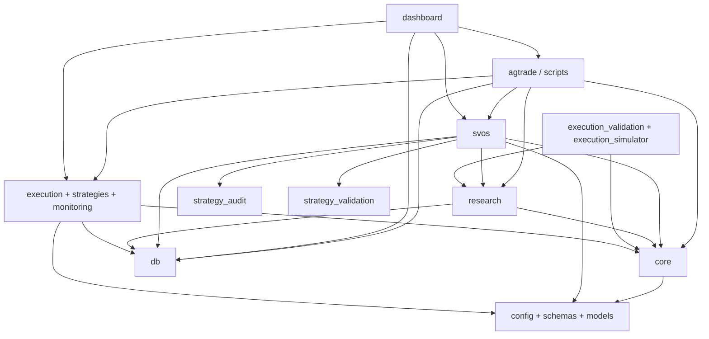
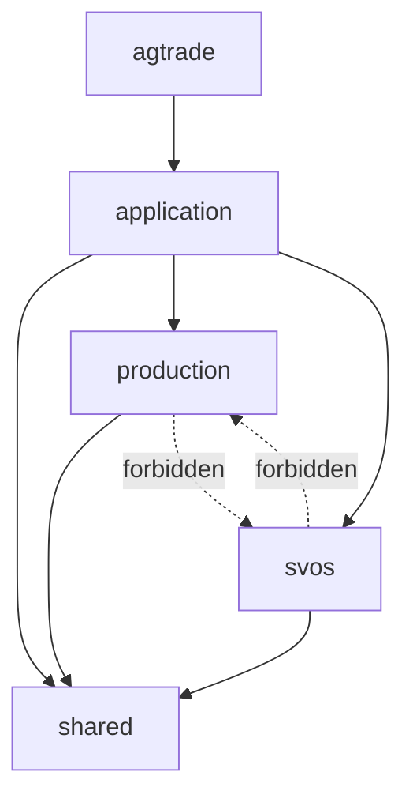

# Dependency Graph

Date: 2026-07-01
Scope: package-level architectural dependency view

## Current Package-Level Graph

## Current Dependency Characteristics

### Healthy patterns

- `svos/ports/` exists as an architectural direction toward dependency inversion
- `agtrade` provides a central application entry surface
- architecture tests already enforce some lifecycle and port rules

### Problematic patterns

- dashboard layer imports both SVOS and production internals
- scripts act as cross-boundary orchestrators with little isolation
- persistence layer is globally shared instead of boundary-specific
- current `core/` package is both shared-domain and runtime-domain

## Production Import Restrictions To Add

Future architecture tests should forbid production code from importing:

- `svos.replay`
- `svos.validation`
- `svos.robustness`
- `svos.datasets`
- `research.*`
- `execution_validation.*`
- `execution_simulator.*`

## SVOS Import Restrictions To Add

Future architecture tests should forbid SVOS code from importing:

- live broker adapters
- runtime order router
- live position manager
- production dashboard runtime services

## Target Graph

## Main Hidden Coupling Edges

- `dashboard -> scripts`
- `dashboard -> execution`
- `dashboard -> svos`
- `scripts -> execution + svos + research`
- `core.strategy_registry -> multiple layers`
- `config/strategy_catalog.yaml -> global coordination point`
- `logs/` and `reports/` -> shared side-channel data bus
