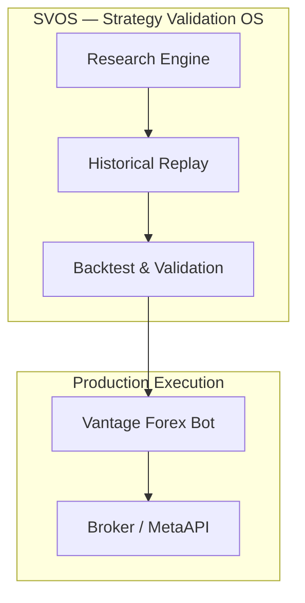

# System Architecture (consolidated view)

---
Owner: Architecture Team
Status: Consolidated (non-authoritative)
Version: 0.1
Last Reviewed: TODO
Next Review: TODO
Related Documents: ../SYSTEM_ARCHITECTURE.md, ../svos/CORE_ARCHITECTURE.md
---

NOTE: `docs/SYSTEM_ARCHITECTURE.md` at the repository root is the single authoritative architecture document. This file is the consolidated architecture view for consumption under `docs/architecture/` and must not redefine lifecycle authority — instead it cross-references the canonical document.

High-level overview

This document provides an accessible consolidation for architecture readers. For authoritative lifecycle vocabulary, policies, and stage authority, see: [docs/SYSTEM_ARCHITECTURE.md](../SYSTEM_ARCHITECTURE.md).

Component mapping (where to find implementation-level docs)

- Strategy Engineering Platform (SVOS): `docs/svos/CORE_ARCHITECTURE.md`
- Trading Bot / Production Execution: `docs/EXECUTION_SPEC.md`, `production/`, `execution/`
- Historical Replay: `docs/HISTORICAL_REPLAY.md`, `historical_replay/`
- Validation Pipeline: `docs/STRATEGY_ENGINEERING_PLATFORM_IMPLEMENTATION_PLAN.md`, `docs/BACKTEST_SPEC.md`
- Approval Package: `approval_package/`, `docs/approval_package/` (see `approval_package/package_registry.py`)
- Dashboard: `docs/dashboard_reuse_assessment/`, `dashboard/`
- Demo Runtime: `demo_runtime/`, `docs/VPS_DEPLOYMENT_RUNBOOK.md`
- Deployment: `deploy/`, `deploy/gcp-vm1/README.md`, `docs/svos/DEPLOYMENT_TOPOLOGY.md`

Lifecycle cross-reference (summary)

The canonical lifecycle is declared in `docs/SYSTEM_ARCHITECTURE.md`. For convenience, the following table maps common system terms to the canonical lifecycle stages and their primary owners.

| Area | Canonical Lifecycle Stage(s) | Primary Owner / Doc |
|---|---|---|
| Strategy Engineering Platform (SVOS) | DRAFT, INTAKE, AUDIT, REFINEMENT, HISTORICAL_REPLAY | `docs/svos/CORE_ARCHITECTURE.md` |
| Historical Replay | HISTORICAL_REPLAY | `docs/HISTORICAL_REPLAY.md` |
| Backtest & Statistical Validation | BACKTEST, STATISTICAL_VALIDATION | `docs/BACKTEST_SPEC.md` |
| Robustness Validation | ROBUSTNESS_VALIDATION | `docs/svos/CORE_ARCHITECTURE.md` |
| Virtual Demo / EVF | VIRTUAL_DEMO, EXECUTION_VALIDATION | `docs/SVOS_EVF_USER_MANUAL.md`, `docs/EXECUTION_SPEC.md` |
| Approval Package / Governance | PRODUCTION_APPROVAL, GOVERNANCE | `approval_package/`, `docs/PROJECT_OBJECTIVE.md` |
| Production Execution (Vantage bot) | PRODUCTION_CANDIDATE, PRODUCTION | `production/`, `execution/`, `docs/VPS_DEPLOYMENT_RUNBOOK.md` |
| Dashboard & Monitoring | MONITORING, SMO | `dashboard/`, `monitoring/`, `docs/operations/monitoring_endpoints.md` |
| Deployment | DEPLOYMENT (topology) | `docs/svos/DEPLOYMENT_TOPOLOGY.md`, `deploy/` |

Owner: Architecture Team (TODO: add person)
Last reviewed: TODO
