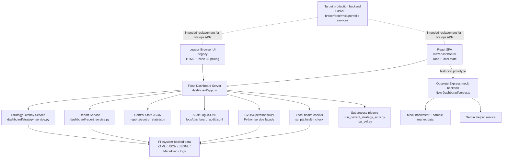

# Dashboard Audit

## Scope

This audit evaluates whether the repository's existing dashboard assets can be reused as the Live Trading Dashboard for an industrial-grade trading platform.

Excluded from scope:

- Strategy quality or profitability
- Replacement of SVOS or EVF
- Refactoring or implementing missing features

Assumption:

- The production backend already exists in FastAPI and is the source of truth for live trading, portfolio, broker, risk, and execution services.

## Executive Read

The repository contains two different dashboard implementations:

1. A Flask-served legacy operations dashboard at `/legacy`, implemented as a single HTML file with JavaScript polling.
2. A React/Vite dashboard at `/new-dashboard/`, backed in this repo by Python bridge endpoints and historically by a separate Express mock server.

Neither implementation is a clean fit for a production Live Trading Dashboard as-is.

The legacy dashboard is closer to live operations because it already shows trade journals, runtime status, incidents, reports, and emergency-stop state. But it is tightly coupled to SVOS, EVF, filesystem reports, polling, and local control-state files.

The React dashboard is visually more reusable, but it is fundamentally a strategy validation workstation, not a live trading console. Its tabs, data types, and workflows are centered on validation stages, audit evidence, replay, robustness, virtual demo, and governance.

## Architecture Summary

### Frontend frameworks

- Legacy dashboard: server-rendered static HTML with inline CSS and vanilla JavaScript in [dashboard/index.html](dashboard/index.html:1)
- New dashboard: React 19 + TypeScript + Vite + Tailwind-style utility classes in [New Dashborad/package.json](New%20Dashborad/package.json:1) and [New Dashborad/src/App.tsx](New%20Dashborad/src/App.tsx:1)

### Backend frameworks

- Active backend: Flask app in [dashboard/app.py](dashboard/app.py:1)
- Auxiliary services: Python modules for strategy overlay, reports, audit log, control state, Gemini helpers in [dashboard/strategy_service.py](dashboard/strategy_service.py:1), [dashboard/report_service.py](dashboard/report_service.py:1), [dashboard/control_state.py](dashboard/control_state.py:1), [dashboard/gemini_service.py](dashboard/gemini_service.py:1)
- Obsolete prototype backend: Express server in [New Dashborad/server.ts](New%20Dashborad/server.ts:1)

### Routing

- Flask routes serve APIs, legacy HTML, and built React assets from a single process
- Legacy page routing:
  - `/` redirects to `/new-dashboard/`
  - `/legacy` serves the old control panel
- New dashboard routing:
  - `/new-dashboard/` serves the React SPA shell
  - `/new-dashboard/<path>` serves static assets or SPA fallback
- React navigation is internal tab state, not URL-based routing

### State management

- Legacy dashboard: ephemeral browser state plus repeated polling every 30 seconds via `refreshAll()` in [dashboard/index.html](dashboard/index.html:2169)
- React dashboard: local component state with `useState` and `useEffect`; no Redux, no React Query, no API client abstraction
- Server-side mutable state:
  - JSON overlay for strategies
  - JSON control-state for emergency stop and acknowledgments
  - JSONL audit log
  - report indexes generated from filesystem

### Authentication

- Flask applies bearer token plus actor and role headers only on selected mutating endpoints via `_require_operator()` in [dashboard/app.py](dashboard/app.py:81)
- Read endpoints are mostly unauthenticated
- New dashboard strategy mutation endpoints under `/api/new-dashboard/*` currently have no authentication decorator
- React frontend has no auth flow, session handling, or token management

### Real-time support

- No WebSocket server in Flask
- No browser WebSocket client in either dashboard
- Legacy dashboard uses interval polling every 30 seconds
- React virtual demo uses local `setInterval()` simulation only; it does not consume live backend streams

### API layer

- Flask exposes many REST-style JSON endpoints for SVOS, EVF, reports, status, monitoring, trade journal, and new-dashboard overlays
- React fetches directly with `fetch("/api/...")` and has no typed API client layer or service abstraction
- Express prototype exposes a separate mock API surface unrelated to the production Flask routes

### Service layer

- The real service layer is thin and local:
  - files, YAML, JSON, JSONL, generated reports
  - subprocess triggers for SVOS and EVF
  - local health checks
  - overlay mapper bridging SVOS reports into React strategy schemas

This is not the architecture expected for a production live trading dashboard that should consume remote FastAPI services for portfolio, orders, broker, risk, and execution.

## Architecture Diagram

## Live Trading Reuse Assessment

### What is reusable

- Legacy operational panel layout patterns:
  - status bar
  - metric cards
  - incident feed
  - emergency stop UI
  - trade journal table
- React presentation components and visual patterns:
  - header shell
  - card system
  - charts using `recharts`
  - responsive grid layouts
  - timeline and tab presentation patterns
- Some domain-neutral support utilities:
  - report display patterns
  - filter chips
  - generic tables

### What is not reusable

- SVOS-specific navigation, stage vocabulary, and workflows
- EVF-specific validation panels as part of the live trading console
- Filesystem-backed dashboard backend
- local JSON overlay strategy persistence
- local control-state as operational source of truth
- polling-only update model for live operations
- unauthenticated read endpoints and inconsistent auth on writes
- Express mock backend and client-side simulation logic

## Conclusion

This repository does not contain a production-ready Live Trading Dashboard. It contains:

- one operations-oriented but tightly coupled legacy monitoring panel
- one visually richer but validation-centric research workstation

Best recommendation:

- reuse selected UI patterns and some components
- discard the current dashboard backend
- reconnect the kept UI to production FastAPI services
- keep SVOS and EVF separate rather than embedding them into the live trading console

The dashboard can be reused only as a partial UI foundation, not as a full application.
