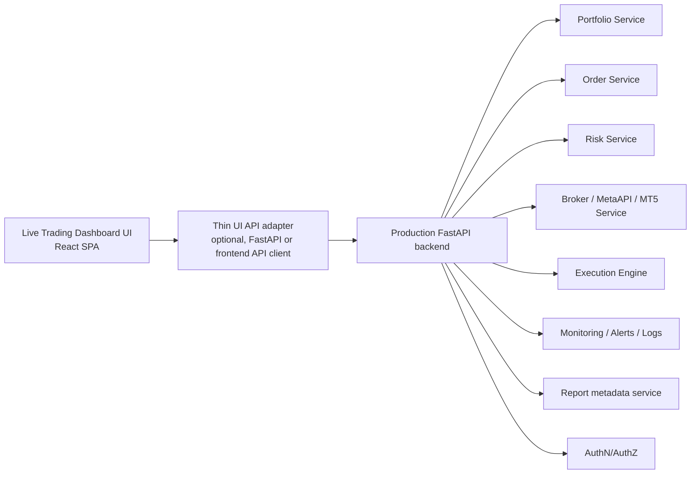

# Migration Plan

## Target Outcome

Reuse only the dashboard UI shell and selected presentation components, while replacing the entire dashboard backend dependency model with the production FastAPI backend.

SVOS and EVF remain separate systems.

## Recommended Target Architecture

## Recommended Reuse Strategy

### Keep

- React shell and reusable visual components
- selected legacy operational concepts:
  - top status summary
  - trade journal
  - incident feed
  - emergency control layout

### Replace

- Flask dashboard backend
- local filesystem-backed state
- report generation triggers
- strategy overlay service
- demo runner file readers
- mock Express backend
- polling-only refresh model

## Step-by-Step Plan

### Phase 1. Separate concerns

1. Freeze the current dashboard backend as reference only.
2. Treat `/legacy` and `/new-dashboard/*` as UI source material, not as deployable production apps.
3. Define the live dashboard scope clearly:
   - portfolio
   - positions
   - pending orders
   - fills / trade history
   - broker connectivity
   - execution status
   - risk
   - margin / balance / equity / exposure
   - logs / alerts
   - session status

### Phase 2. Choose the UI base

Recommended base:

- use the React SPA as the primary frontend foundation

Reason:

- better structure
- better responsiveness
- component reuse is much easier
- charts and layouts are already separated

Use selected legacy concepts only as design references for:

- incident feed
- runtime overview cards
- trade journal structure
- emergency control affordances

### Phase 3. Introduce a real frontend API layer

1. Replace component-local `fetch()` calls with a typed API client.
2. Group endpoints by domain:
   - `portfolioApi`
   - `ordersApi`
   - `riskApi`
   - `brokerApi`
   - `monitoringApi`
   - `reportsApi`
3. Normalize response models away from current SVOS-specific payloads.

### Phase 4. Replace page/tab semantics

Remove or replace these tabs:

- `AI Audit & Refinement`
- `Historical Replay & Stats`
- `Robustness & Stress Test`
- `Governance & Ledger`
- `Full Pipeline Report`

Create live-trading tabs/pages such as:

- Overview
- Portfolio
- Positions
- Orders
- Executions
- Risk
- Broker
- Alerts & Logs
- Reports

### Phase 5. Map existing UI pieces to production APIs

| Current UI concept | Replacement production source |
| --- | --- |
| Legacy status bar | aggregate FastAPI overview endpoint |
| Trade journal | trade history service |
| Demo runtime | broker + execution + portfolio services |
| Incident feed | monitoring / alerts service |
| Emergency stop controls | production risk kill-switch endpoint |
| Report cards | report metadata service |
| React charts | PnL, equity, latency, drawdown, exposure timeseries |

### Phase 6. Add realtime transport

1. Introduce WebSocket or SSE channels from FastAPI for:
   - broker connectivity
   - position changes
   - order/fill lifecycle
   - price ticks if needed by UI
   - alerts
   - heartbeats
2. Keep polling only for low-frequency report metadata if desired.

### Phase 7. Add authentication and authorization

1. Introduce proper session or token handling in the frontend.
2. Protect all read and write operations.
3. Enforce role-based authorization for:
   - emergency stop
   - order actions
   - account controls
   - sensitive logs

### Phase 8. Remove local state dependencies

Eliminate dependency on:

- `reports/control_state.json`
- `logs/dashboard_audit.jsonl`
- `reports/dashboard_strategies.json`
- direct reads of local logs, YAML, JSON, JSONL, Markdown

Replace with:

- service APIs
- production audit/event store
- production monitoring/logging pipeline

### Phase 9. Production hardening

1. Add proper error boundaries and retry behavior.
2. Add loading skeletons and disconnected-state UI.
3. Add audit-safe confirmations for high-risk actions.
4. Add observability for frontend errors and latency.

## Estimated Effort

- UI-only lift: Medium
- Full production live dashboard migration: High

Reason:

- reusable visuals exist
- reusable backend does not
- data contracts must be redesigned around the production FastAPI services
- realtime, auth, and operational safety still need proper architecture

## Suggested Delivery Sequence

1. Build a new React live-ops shell using existing component patterns.
2. Wire overview, portfolio, positions, orders, and alerts to FastAPI.
3. Add broker connectivity and execution event streams.
4. Add risk controls and emergency-stop flow.
5. Add reports and historical trade views.
6. Retire dashboard Flask backend from the live-trading path.

## Final Migration Recommendation

Do not migrate the current dashboard backend.

Migrate only selected UI patterns and presentation components into a new React frontend connected directly to the production FastAPI backend.
