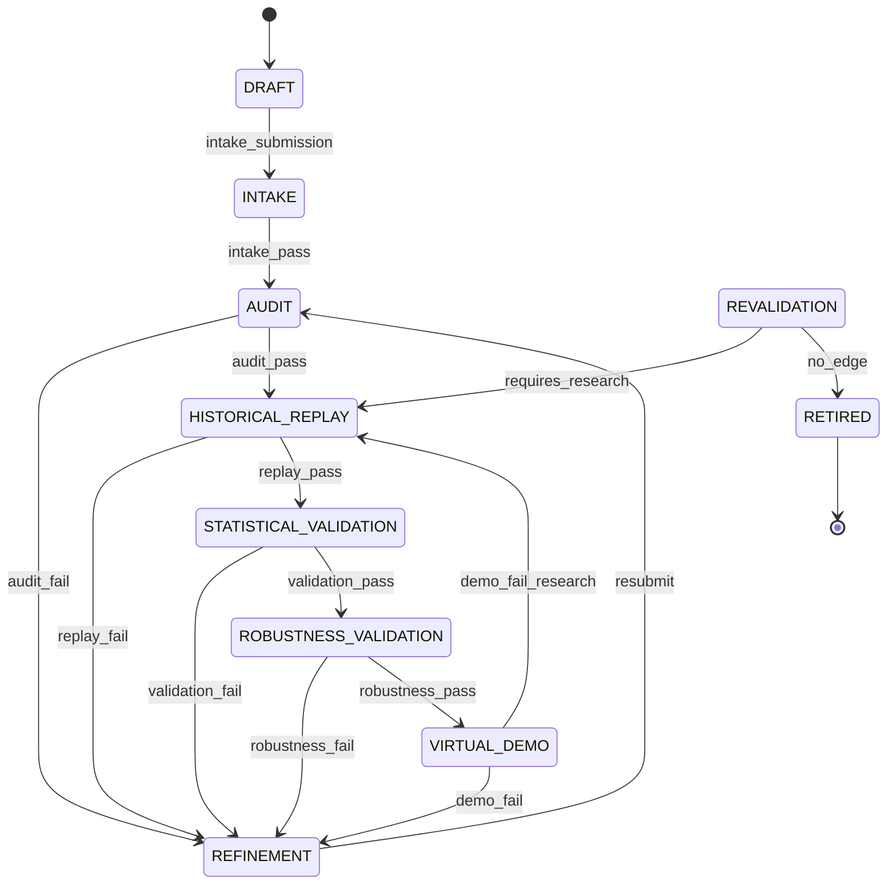

# SVOS Core Architecture

Status: Authoritative
Version: 1.0
Updated: 2026-06-29
Owner: Platform Architecture
Authority: Level 3 — Implementation
Related: SYSTEM_ARCHITECTURE.md, ADR-0001-STABILIZATION-FOUNDATION.md, DOC_AUTHORITY.md

Product conformance: `docs/00_Project/TWO_SYSTEM_ARCHITECTURE_TRUTH.md` governs.
The missing standalone `BACKTEST` state below is recorded implementation debt;
Backtest and Statistical Validation are distinct in the product lifecycle.

Scope: subsystem 1 of the incremental SVOS delivery plan

## Functional specification

The core subsystem owns strategy identity, immutable version history, lifecycle
state, evidence references, gate decisions, approvals, and transitions. A
strategy may move only to an adjacent lifecycle stage and only through the
governance service. Except for intake/refinement/revalidation control paths, a
promotion requires a `PASS` artifact for the current stage and current strategy
version. Entry to live demo or production additionally requires an explicit,
named approval with a reason. Every transition also requires an actor and audit
reason.

The core does not implement trading logic, calculate research statistics, or
submit orders. Those systems provide evidence to this control plane.

## Architecture and folder structure

```text
svos/
  lifecycle/       canonical state machine and legal transitions
  registry/        strategy state, versions, evidence, transitions
  governance/      qualification evaluation and approvals
  orchestration/   public application service composing the core
  reports/         artifact hashing and normalized report index
  shared/          persisted domain records and storage helpers
  api/             read-oriented operational facade
```

Dependency direction is `orchestration -> governance -> registry -> lifecycle`.
Research, execution simulation, and live execution are downstream adapters and
must not mutate lifecycle state directly.

## Lifecycle

> **Vocabulary note:** These stage names are the canonical identifiers used
> in `svos/lifecycle/manager.py`, all code, and all documentation. Legacy
> "Phase N" numbering is a summary view only. See `docs/00_Project/DOC_AUTHORITY.md`.

The current implemented progression begins:

```text
DRAFT -> INTAKE -> AUDIT -> REFINEMENT -> HISTORICAL_REPLAY
 -> STATISTICAL_VALIDATION -> ROBUSTNESS_VALIDATION
 -> VIRTUAL_DEMO

Stage vocabulary also includes `PRODUCTION_APPROVAL`, `REVALIDATION`, and
`RETIRED`, but `PRODUCTION_APPROVAL` is record-only and not currently reachable
through forward promotion during construction.
```

The target product progression inserts `BACKTEST` between
`HISTORICAL_REPLAY` and `STATISTICAL_VALIDATION`. Until the state machine is
migrated, `STATISTICAL_VALIDATION` is a transitional combined implementation
identifier and must not redefine the Original Truth.



Revalidation may return a strategy to historical replay or retire it. Failed
replay, statistical validation, robustness, and virtual demo stages may return
to refinement; virtual demo may also return to historical replay when the
failure requires research rework. These remediation paths do not permit forward
execution-stage skipping.

## Application API

`SVOSPlatform.record_report_evidence(...)`
: Hash and index an artifact, then append a version-linked evidence record.

`SVOSPlatform.audited_transition(strategy, to_stage, actor, reason)`
: Evaluate the gate, persist the decision, and perform the transition only when
allowed. A denied decision is retained for audit.

`SVOSPlatform.approve_transition(strategy, to_stage, approver, reason)`
: Append an approval bound to the current stage, target stage, and strategy
version. Approvals cannot silently carry across versions.

`SVOSPlatform.strategy_summary(strategy)`
: Return state, versions, evidence, transitions, gate decisions, and approvals.

## Storage schema

The catalog remains the compatibility-facing strategy manifest. The
append-only control records are stored below `data/svos/`:

```text
registry/<strategy>/state.json
registry/<strategy>/versions.jsonl
registry/<strategy>/evidence.jsonl
registry/<strategy>/transitions.jsonl
governance/<strategy>/decisions.jsonl
governance/<strategy>/approvals.jsonl
reports/index.json
```

Every transition references its governance decision ID. Every evidence record
contains the current version ID and strategy version. Artifacts are content
hashed; missing artifacts cannot satisfy a gate.

## Validation criteria

- Unknown and non-adjacent transitions fail closed.
- Registry transitions without an allowed, state-matching decision fail closed.
- Failed, missing, hashless, wrong-stage, and old-version evidence cannot promote.
- Denied gate decisions remain queryable.
- Live-demo and production entry require a version-bound human approval.
- Successful transitions append history and update registry/catalog state.
- Existing research calculations and execution components remain unchanged.

## Test plan

Unit coverage is in `tests/svos/test_platform.py` and includes lifecycle
legality, bootstrap/version history, evidence registration, successful gated
promotion, missing-evidence denial, version-lineage denial, bypass prevention,
and explicit approval. Repository integration tests remain the regression gate.

## Next subsystem

The next incremental subsystem is the research database and specification
intake boundary. It should consume this core API rather than introduce another
lifecycle or promotion path.
