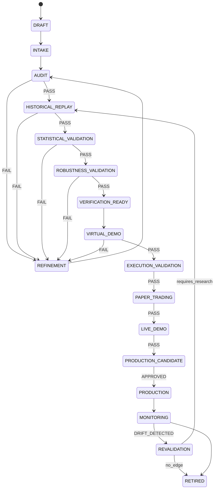

# SVOS Documentation Audit Report
# Version 1.1 | Date: 2026-06-29
# Lead: Documentation QA & Quant System Architecture Review
# Reviewed: 2026-06-29 — Architecture Assessment incorporated

<!--
Revision history:
  v1.0 — initial audit across 15 phases
  v1.1 — reviewer assessment incorporated: adjusted scores, added 5 missing
          issues (authority hierarchy, document versioning, dependency graph,
          traceability, quality gates), added 6 required diagrams, revised
          priority ordering, added database authority formalization
-->

---

## Executive Summary

This audit covers the complete active documentation corpus of the SVOS repository
(`session-smc-trading-bot`). The project is a **Strategy Validation & Optimization
System (SVOS)** — an institutional-style strategy research, validation, and governance
platform for systematic Forex strategies.

**Audit scope:**

- 155+ active documentation files across `docs/`, `reports/`, `research/`, `data/`,
  `scripts/`, `examples/`, root, plus inline code-level docs
- Cross-referenced against 411 active Python files (67,046 lines) and 1,170 passing tests
- Evaluated against the governing implementation plan (`docs/svos/STRATEGY_ENGINEERING_PLATFORM_IMPLEMENTATION_PLAN.md`)
  and the architecture review (`docs/svos/architecture-review-2026-06-29/`)

**Overall Documentation Health Score: 62 / 100 (Reviewer assessment: 70–75)**

| Dimension | Audit Score | Reviewer Assessment | Key Driver |
|---|---:|---:|---|
| Coverage | 72% | 78% | Architecture itself is mature; most gap is synchronization |
| Consistency | 54% | 55% | Lifecycle vocabulary fragmentation is the dominant drag |
| Architecture Accuracy | 68% | 74% | Strong intent; transitional drift is the problem |
| Database Documentation | 61% | 68% | JSONL→PostgreSQL transition undocumented |
| Strategy Documentation | 78% | 82% | ST-A2 complete; others need canonical format |
| Testing Documentation | 55% | 60% | Tests pass; traceability and architecture test docs missing |
| Reporting Documentation | 71% | 75% | Governing plan detailed; report schemas not fully written |
| Maintainability | 58% | 63% | Missing authority hierarchy and versioning standard |
| **Overall** | **62%** | **70–75%** | |

**Why reviewer scores higher:** The architecture is already fairly mature. Most missing
points come from documentation synchronization debt, not missing design. Addressing the
five governance issues identified in Part 19 (authority hierarchy, versioning, dependency
graph, traceability, quality gates) should move the score to 90+ without any new features.

**Verdict:** The documentation is substantive and architecturally ambitious, but is
currently in a state of **controlled transition debt**. The core documents are strong
and well-reasoned. The critical problem is that superseded, inconsistent, and legacy
documents remain easily discoverable and can mislead both developers and AI agents.
Targeted cleanup and a consistent cross-linking strategy would move the score to 80+.

**Top 3 critical issues:**

1. **Multiple conflicting lifecycle models** across 5+ documents using different stage
   names, phase numbers, and vocabulary for the same pipeline.
2. **Superseded documents remain prominent** with only a disclaimer banner — they are
   easily encountered without context and contradict the governing plan.
3. **Archive policy is implicit** — the `archive/` directory contains unrelated older
   docs with no index, making it unclear what should move there.

---

## Part 1 — Documentation Inventory

### 1.1 Active Documentation Files (by area)

#### Root-Level Documentation

| File | Purpose | Status | Size |
|---|---|---|---|
| `README.md` | Project entry point, architecture overview, quick-start | Current | Large (~1,400 lines) |
| `CLAUDE.md` | AI agent rules, system constraints, confirm tokens | Current — governing | Medium |
| `LOOKAHEAD_AUDIT.md` | Lookahead-bias audit for strategy implementations | Dated historical | Medium |

**Assessment:** `README.md` is thorough but **too large** for an entry point. It serves
three audiences (developer, operator, AI) simultaneously and should be split. `CLAUDE.md`
is excellent and tightly maintained. `LOOKAHEAD_AUDIT.md` has no date header and no
supersession notice; its currency is unknown.

---

#### docs/ — Core Documentation (91 files)

**Governing / Authoritative:**

| File | Purpose | Status |
|---|---|---|
| `docs/SYSTEM_ARCHITECTURE.md` | Authoritative architecture and lifecycle reference | Current — canonical |
| `docs/DEVELOPER_HANDBOOK.md` | Implementation constitution | Current |
| `docs/AI_WORKFLOW_ARCHITECTURE.md` | AI workflow and prompt layering | Current |
| `docs/VERDICT_LOG.md` | Immutable trial verdict record | Current — append-only |
| `docs/AGENT_RULES.md` | AI agent behavioral rules | Current |
| `docs/svos/STRATEGY_ENGINEERING_PLATFORM_IMPLEMENTATION_PLAN.md` | Governing product plan | **GOVERNING — 2026-06-29** |
| `docs/svos/ADR-0001-STABILIZATION-FOUNDATION.md` | Architecture decisions, accepted | Current ADR |
| `docs/svos/CORE_ARCHITECTURE.md` | SVOS backend domain spec | Current |
| `docs/svos/CURRENT_STATE.md` | State audit with update annotation | Partially superseded |
| `docs/svos/DEPLOYMENT_TOPOLOGY.md` | Two-node infrastructure boundary | Current |
| `docs/svos/PLATFORM_IMPLEMENTATION_REQUIREMENTS.md` | Reusable component inventory | Current |
| `docs/svos/PREFLIGHT_STATUS.md` | Preflight checklist status | Current |
| `docs/svos/STABILIZATION_STATUS.md` | Active stabilization tracking | Current |

**Architecture Review (authoritative sub-corpus):**

| File | Purpose |
|---|---|
| `docs/svos/architecture-review-2026-06-29/README.md` | Index, NOT READY decision |
| `docs/svos/architecture-review-2026-06-29/00_EXECUTIVE_SUMMARY.md` | Overall findings |
| `docs/svos/architecture-review-2026-06-29/01_ARCHITECTURE_ASSESSMENT.md` | Architecture findings |
| `docs/svos/architecture-review-2026-06-29/02_DATABASE_ASSESSMENT.md` | Database findings |
| `docs/svos/architecture-review-2026-06-29/03_CODE_QUALITY.md` | Code quality findings |
| `docs/svos/architecture-review-2026-06-29/04_GAP_ANALYSIS.md` | Gap analysis |
| `docs/svos/architecture-review-2026-06-29/05_RISK_ASSESSMENT.md` | Risk register |
| `docs/svos/architecture-review-2026-06-29/06_UPGRADE_ROADMAP.md` | Active upgrade sequence |

**Superseded (with banners, but still discoverable):**

| File | Superseded By | Risk |
|---|---|---|
| `docs/CURRENT_SCOPE.md` | `STRATEGY_ENGINEERING_PLATFORM_IMPLEMENTATION_PLAN.md` | HIGH — contradicts governing scope |
| `docs/IMPLEMENTATION_STATUS.md` | `STRATEGY_ENGINEERING_PLATFORM_IMPLEMENTATION_PLAN.md` + `06_UPGRADE_ROADMAP.md` | MEDIUM |
| `docs/ESTIMATED_DEVELOPMENT_ROADMAP.md` | `STRATEGY_ENGINEERING_PLATFORM_IMPLEMENTATION_PLAN.md` | MEDIUM — phase numbering conflict |

**Specification Documents:**

| File | Purpose | Status |
|---|---|---|
| `docs/STAGE1_AUDIT_SPEC.md` | Strategy audit phase spec (10 validators) | Current |
| `docs/HISTORICAL_REPLAY.md` | Replay phase architecture | Current |
| `docs/HISTORICAL_DATA_ARCHITECTURE.md` | Data layer specification | Current |
| `docs/EXECUTION_LAYER_VALIDATION_SPEC.md` | EVF execution validation spec | Current |
| `docs/SVOS_DESIGN_REFERENCE.md` | Full pipeline design reference | Current |
| `docs/SVOS_EVF_USER_MANUAL.md` | Operator user manual | Current |
| `docs/SVOS_LIFECYCLE_WORKFLOW.md` | Lifecycle workflow guide | Current |
| `docs/QUANT_PLATFORM_ARCHITECTURE.md` | Platform architecture detail | Partially superseded |
| `docs/VALIDATION_GATE_ENGINE.md` | Gate engine spec | Current |
| `docs/STRATEGY_AUDIT_FRAMEWORK.md` | Audit framework overview | Current |
| `docs/RESEARCH_ENGINE.md` | Research engine spec | Current |
| `docs/RESEARCH_FEATURE_DATABASE.md` | Feature database spec | Current |
| `docs/REPORT_SYSTEM.md` | Report system design | Current |
| `docs/DATABASE_ARCHITECTURE_VERIFICATION.md` | DB architecture verification | Needs DB sync |
| `docs/RISK_SPEC.md` | Risk specification | Current |
| `docs/SIGNAL_SPEC.md` | Signal specification | Current |
| `docs/SMC_FEATURE_SPEC.md` | SMC feature definitions | Current |

**Strategy-Specific Evidence Documents (ST-A2):**

| File | Purpose | Status |
|---|---|---|
| `docs/ST_A2_CONFIRMATION.md` | EXP-01 confirmation | Legacy research |
| `docs/ST_A2_D1_COMPARISON_REPORT.md` | D1 comparison | Legacy research |
| `docs/ST_A2_D1_FINAL_VERDICT.md` | D1 final verdict | Legacy research |
| `docs/ST_A2_D1_IMPLEMENTATION_REPORT.md` | D1 implementation | Legacy research |
| `docs/ST_A2_DEMO_GO_LIVE_REPORT.md` | Demo go-live | Legacy — deferred |
| `docs/ST_A2_DEMO_RISK_POLICY.md` | Demo risk policy | Legacy — deferred |
| `docs/ST_A2_FIRST_30_TRADES_PLAN.md` | 30-trade plan | Legacy — deferred |
| `docs/ST_A2_OPPORTUNITY_ANALYSIS.md` | Opportunity analysis | Legacy research |
| `docs/ST_A2_VANTAGE_DEMO_RUNBOOK.md` | Demo runbook | Legacy — deferred |
| `docs/TRIAL_ST_A2_D1_SPEC.md` | D1 trial spec | Legacy research |

**Operational Documents:**

| File | Purpose | Status |
|---|---|---|
| `docs/DEPLOYMENT_READINESS.md` | Deployment readiness checklist | Dated |
| `docs/VPS_DEPLOYMENT_RUNBOOK.md` | VPS deployment runbook | Dated |
| `docs/OPERATING_MANUAL.md` | Operating manual | Dated |
| `docs/INCIDENT_RESPONSE.md` | Incident response procedures | Current |
| `docs/ISOP_CONTROL_PANEL.md` | Control panel spec | Current |
| `docs/STRATEGY_PORTFOLIO_ROADMAP.md` | Portfolio roadmap | Partially current |
| `docs/CLEANUP_SUMMARY.md` | Cleanup summary | Dated |
| `docs/REPOSITORY_AUDIT.md` | Prior repository audit | Historical |
| `docs/PROJECT_LIVE_STATUS_TIMELINE.md` | Live status timeline | Legacy |
| `docs/PROJECT_OBJECTIVE_FASTEST_PATH.md` | Fastest path objective | Legacy — contradicts current |
| `docs/PROJECT_STATUS.md` | Project status | Dated |
| `docs/TASK_QUEUE.md` | Task queue | Dated |
| `docs/LIVE_CAPITAL_SCALING_PLAN.md` | Capital scaling plan | Deferred |

**Backtest and Research Evidence:**

| File | Purpose |
|---|---|
| `docs/BACKTEST_RESULTS.md` | ST-A backtest results |
| `docs/BACKTEST_SPEC.md` | Backtest spec |
| `docs/BACKTEST_COST_REVALIDATION_REPORT.md` | Cost revalidation |
| `docs/BACKTEST_FAILURE_ANALYSIS.md` | Failure analysis |
| `docs/BIAS_FILTER_AUDIT.md` | Bias filter audit |
| `docs/ENTRY_ENGINE_AUDIT.md` | Entry engine audit |
| `docs/SWEEP_DETECTOR_AUDIT.md` | Sweep detector audit |
| `docs/EXPERIMENT_RESULTS.md` | Experiment results |
| `docs/FORWARD_TEST_VALIDATION.md` | Forward test validation |
| `docs/SPREAD_RESEARCH_FINAL_REPORT.md` | Spread research |
| `docs/SPREAD_CAPTURE_PLAN.md` | Spread capture plan |

**Other docs/:**

| File | Purpose | Status |
|---|---|---|
| `docs/STRATEGY_A_SESSION.md` | Strategy A session spec | Legacy |
| `docs/STRATEGY_B_SMC.md` | Strategy B SMC spec | Current |
| `docs/ST_B_RESEARCH_PLAN.md` | ST-B research plan | Current |
| `docs/ADAPTIVE_ENGINE_V1.md` | Adaptive engine V1 spec | Historical |
| `docs/TIMEFRAME_GENERATION.md` | Timeframe generation | Current |
| `docs/TIMEZONE_AUDIT.md` | Timezone audit | Current |
| `docs/HISTORICAL_DATA_AUDIT.md` | Data audit | Historical |
| `docs/HISTORICAL_DATA_PIPELINE_FINAL_REPORT.md` | Pipeline report | Historical |
| `docs/PHASE22_COLLECTION_HEALTH.md` | Collection health | Historical |
| `docs/DOWNLOADER_USAGE.md` | Downloader usage | Current |
| `docs/REPLAY_INTEGRATION_PLAN.md` | Replay integration | Current |
| `docs/WALK_FORWARD_RESEARCH_PLAN.md` | Walk-forward plan | Current |
| `docs/SVOS_STRATEGY_AUDIT_GAP_CLOSURE_PLAN.md` | Audit gap closure | Current |
| `docs/SVOS_STRATEGY_AUDIT_LOOP_REPORT.md` | Audit loop report | Current |
| `docs/SVOS_STRATEGY_AUDIT_WORKFLOW_VALIDATION.md` | Audit workflow validation | Current |
| `docs/DEMO_GATE_DECISION.md` | Demo gate decision | Legacy |
| `docs/PRE_E6_BASELINE.md` | E6 baseline | Historical |
| `docs/OPS02_ACTIVATION_CHECKLIST.md` | Activation checklist | Dated |
| `docs/OPS02_REVISED_GATE.md` | Revised gate | Dated |
| `docs/VALIDATION_01_SINGLE_DAY.md` | Single-day validation | Historical |
| `docs/BUG01_RUNTIME_VALIDATION.md` | Bug runtime validation | Historical |
| `docs/DEP_02_CONNECTION_REPORT.md` | Connection report | Historical |
| `docs/DRY_RUN_2023_03_14.md` | Dry run | Historical |
| `docs/EXECUTION_SPEC.md` | Execution spec | Partially current |
| `docs/VANTAGE_DEMO_CONNECTION_CHECKLIST.md` | Vantage checklist | Dated |

**Strategy Audit Subdirectory (`docs/strategy_audit/`):**

| File | Purpose |
|---|---|
| `01_strategy_inventory.md` | Strategy inventory |
| `02_execution_flow.md` | Execution flow |
| `03_governance_and_risk.md` | Governance and risk |
| `parameters.md` | Parameter catalog |
| `rules.md` | Rule catalog |
| Per-strategy: 6 strategies × (flow, params, quality, risk, rules, strategy_spec) | Strategy audit artifacts |

**Templates (`docs/templates/`):**

| File | Purpose |
|---|---|
| `daily_report_template.md` | Daily report template |
| `implementation_spec_template.md` | Implementation spec template |
| `incident_report_template.md` | Incident report template |
| `live_readiness_template.md` | Live readiness template |
| `risk_report_template.md` | Risk report template |
| `strategy_report_template.md` | Strategy report template |
| `weekly_report_template.md` | Weekly report template |

---

#### reports/ — Generated / Historical Reports (37 files)

These are execution artifacts, not specifications. Most are historical evidence for
research trials. The most important active ones:

| File | Purpose |
|---|---|
| `reports/STA2_2025_VALIDATION_FINAL_REPORT.md` | 2025 validation evidence |
| `reports/STA2_BASELINE_REPORT.md` | Baseline evidence |
| `reports/ST_A2_MANUAL_AUDIT_20_TRADES.md` | Manual audit |
| `reports/svos/SVOS-SAMPLE/` | Sample SVOS pipeline run reports |
| `reports/svos/platform/incidents/` | Platform incident reports |

---

#### research/ — Research Evidence (10 files)

| File | Purpose |
|---|---|
| `research/EXP05_A_RESULTS.md` – `EXP05_E_RESULTS.md` | EXP05 variant results |
| `research/EXP05_FINAL_COMPARISON.md` | Final EXP05 comparison |
| `research/EXP05_RECOMMENDATION.md` | EXP05 recommendation |
| `research/SPREAD_CAPTURE_INTERIM.md` | Spread capture interim |
| `research/README.md` | Research directory guide |

---

#### data/ READMEs (7 files)

Each data subdirectory has a README explaining its content and schema. Generally
well-structured but schema completeness varies.

---

#### examples/ and scripts/ READMEs

- `examples/svos_sample/README.md` and `strategy.md` — sample strategy inputs
- `scripts/analytics/README.md`, `scripts/data/README.md`, `scripts/replay/README.md`

---

#### archive/ — Archived Documentation (60+ files, excluded from active review)

The `archive/` directory contains two archived repositories:
- `archive/docs-phase-complete/` — operational runbooks from a prior phase
- `archive/session-smc-trading-bot-updated/` — prior version of the entire repository

**Problem:** These are buried in the root of the active repository with no archive
index or tombstone documents. Contributors unfamiliar with the history may
accidentally treat archived docs as current.

---

### 1.2 Inventory Summary

| Category | File Count | Status |
|---|---|---|
| Governing / authoritative | 21 | Well-maintained |
| Architecture review (2026-06-29) | 8 | Authoritative, current |
| Specification | 24 | Mixed — some need dating |
| Strategy-specific (ST-A2 legacy) | 14 | Legacy — should be archived |
| Operational | 18 | Mixed — some dated |
| Backtest/research evidence | 24 | Historical |
| Templates | 7 | Current |
| Reports (generated) | 37 | Historical artifacts |
| Research evidence | 10 | Historical |
| Data READMEs | 7 | Current |
| Examples | 4 | Current |
| Scripts READMEs | 3 | Current |
| Root | 3 | Mixed |
| **Total active** | **~180** | |
| Archive (excluded from active audit) | 60+ | Should remain archived |

---

## Part 2 — Document Classification

| Document | Classification | Sub-category |
|---|---|---|
| `README.md` | Project | Entry point |
| `CLAUDE.md` | Project | AI constraints |
| `docs/SYSTEM_ARCHITECTURE.md` | Architecture | Canonical lifecycle |
| `docs/DEVELOPER_HANDBOOK.md` | Development | Implementation constitution |
| `docs/AI_WORKFLOW_ARCHITECTURE.md` | Architecture | AI workflow |
| `docs/AGENT_RULES.md` | Development | AI rules |
| `docs/svos/STRATEGY_ENGINEERING_PLATFORM_IMPLEMENTATION_PLAN.md` | Architecture | Platform spec |
| `docs/svos/ADR-0001-STABILIZATION-FOUNDATION.md` | Architecture | ADR |
| `docs/svos/CORE_ARCHITECTURE.md` | Architecture | SVOS backend |
| `docs/svos/DEPLOYMENT_TOPOLOGY.md` | Deployment | Infrastructure |
| `docs/svos/PLATFORM_IMPLEMENTATION_REQUIREMENTS.md` | Architecture | Requirements |
| `docs/svos/STABILIZATION_STATUS.md` | Project | Stabilization tracking |
| `docs/svos/architecture-review-2026-06-29/` | Architecture | Architecture review |
| `docs/STAGE1_AUDIT_SPEC.md` | Strategy | Audit phase |
| `docs/HISTORICAL_REPLAY.md` | Replay | Replay architecture |
| `docs/HISTORICAL_DATA_ARCHITECTURE.md` | Database | Data layer |
| `docs/EXECUTION_LAYER_VALIDATION_SPEC.md` | Execution | EVF spec |
| `docs/SVOS_DESIGN_REFERENCE.md` | Architecture | Pipeline design |
| `docs/SVOS_EVF_USER_MANUAL.md` | Development | User manual |
| `docs/SVOS_LIFECYCLE_WORKFLOW.md` | Architecture | Lifecycle |
| `docs/QUANT_PLATFORM_ARCHITECTURE.md` | Architecture | Platform architecture |
| `docs/VALIDATION_GATE_ENGINE.md` | Architecture | Gate engine |
| `docs/STRATEGY_AUDIT_FRAMEWORK.md` | Strategy | Audit framework |
| `docs/RESEARCH_ENGINE.md` | Architecture | Research engine |
| `docs/RESEARCH_FEATURE_DATABASE.md` | Database | Feature database |
| `docs/REPORT_SYSTEM.md` | Reporting | Report system |
| `docs/DATABASE_ARCHITECTURE_VERIFICATION.md` | Database | DB verification |
| `docs/RISK_SPEC.md` | Architecture | Risk spec |
| `docs/SIGNAL_SPEC.md` | Strategy | Signal spec |
| `docs/SMC_FEATURE_SPEC.md` | Strategy | SMC features |
| `docs/VERDICT_LOG.md` | Research | Trial log |
| `docs/CURRENT_SCOPE.md` | Project | Superseded scope |
| `docs/IMPLEMENTATION_STATUS.md` | Project | Superseded status |
| `docs/ESTIMATED_DEVELOPMENT_ROADMAP.md` | Project | Superseded roadmap |
| `docs/STRATEGY_A_SESSION.md` | Strategy | Strategy A spec |
| `docs/STRATEGY_B_SMC.md` | Strategy | Strategy B spec |
| `docs/ST_B_RESEARCH_PLAN.md` | Research | ST-B plan |
| `docs/ST_A2_*.md` (×9) | Archive | ST-A2 legacy |
| `docs/TRIAL_ST_A2_D1_SPEC.md` | Archive | ST-A2 legacy |
| `docs/DEPLOYMENT_READINESS.md` | Deployment | Readiness |
| `docs/VPS_DEPLOYMENT_RUNBOOK.md` | Deployment | Operations |
| `docs/OPERATING_MANUAL.md` | Deployment | Operations |
| `docs/INCIDENT_RESPONSE.md` | Deployment | Operations |
| `docs/ISOP_CONTROL_PANEL.md` | Architecture | Control plane |
| `docs/PROJECT_OBJECTIVE_FASTEST_PATH.md` | Archive | Obsolete objective |
| `docs/PROJECT_LIVE_STATUS_TIMELINE.md` | Archive | Dated |
| `docs/BACKTEST_*.md` (×4) | Backtesting | Evidence |
| `docs/EXPERIMENT_RESULTS.md` | Research | Evidence |
| `docs/SPREAD_*.md` (×2) | Research | Evidence |
| `docs/BIAS_FILTER_AUDIT.md` | Research | Evidence |
| `docs/ENTRY_ENGINE_AUDIT.md` | Research | Evidence |
| `docs/SWEEP_DETECTOR_AUDIT.md` | Research | Evidence |
| `docs/SVOS_STRATEGY_AUDIT_*.md` (×3) | Strategy | Audit workflow |
| `docs/WALK_FORWARD_RESEARCH_PLAN.md` | Backtesting | Research plan |
| `docs/REPLAY_INTEGRATION_PLAN.md` | Replay | Integration |
| `docs/TIMEFRAME_GENERATION.md` | Database | Data pipeline |
| `docs/TIMEZONE_AUDIT.md` | Database | Data quality |
| `docs/DOWNLOADER_USAGE.md` | Development | Operations |
| `docs/ADAPTIVE_ENGINE_V1.md` | Archive | Historical |
| `docs/HISTORICAL_DATA_AUDIT.md` | Database | Historical |
| `docs/HISTORICAL_DATA_PIPELINE_FINAL_REPORT.md` | Database | Historical |
| `docs/strategy_audit/` (×25) | Strategy | Per-strategy audits |
| `docs/templates/` (×7) | Development | Templates |
| `reports/` (×37) | Reporting | Generated artifacts |
| `research/` (×10) | Research | Evidence |
| `data/*/README.md` (×7) | Database | Data schemas |

---

## Part 3 — Recommended Documentation Structure

### 3.1 Current Problems with the Structure

1. `docs/` is a flat dump of 91 files. Navigation requires knowledge of file names.
2. Strategy-specific legacy docs sit alongside governing specs.
3. No clear separation between: specifications, evidence, operational, and archived.
4. The `archive/` at root contains prior-repo content but is not referenced by any index.
5. Templates and examples are buried in subdirectories.

### 3.2 Recommended Target Hierarchy

```
docs/
├── 00_Project/
│   ├── README.md                         → entry-level project description
│   ├── GOVERNING_PLAN.md                 → symlink or redirect to svos/STRATEGY_ENGINEERING_PLATFORM_IMPLEMENTATION_PLAN.md
│   ├── DEVELOPER_HANDBOOK.md
│   ├── AGENT_RULES.md
│   └── VERDICT_LOG.md
│
├── 01_Architecture/
│   ├── SYSTEM_ARCHITECTURE.md            → canonical lifecycle + responsibility model
│   ├── AI_WORKFLOW_ARCHITECTURE.md
│   ├── QUANT_PLATFORM_ARCHITECTURE.md
│   ├── ISOP_CONTROL_PANEL.md
│   └── ADR/
│       └── ADR-0001-STABILIZATION-FOUNDATION.md
│
├── 02_SVOS_Core/
│   ├── CORE_ARCHITECTURE.md
│   ├── DEPLOYMENT_TOPOLOGY.md
│   ├── PLATFORM_IMPLEMENTATION_REQUIREMENTS.md
│   ├── STABILIZATION_STATUS.md
│   ├── PREFLIGHT_STATUS.md
│   └── architecture-review-2026-06-29/   → keep as-is
│
├── 03_Pipeline_Stages/
│   ├── STAGE1_AUDIT_SPEC.md              → Phase 1: Strategy Audit
│   ├── HISTORICAL_REPLAY.md              → Phase 2: Replay
│   ├── BACKTEST_SPEC.md                  → Phase 3: Backtest
│   ├── WALK_FORWARD_RESEARCH_PLAN.md     → Phase 4: Robustness
│   ├── SVOS_DESIGN_REFERENCE.md          → Pipeline overview
│   ├── SVOS_LIFECYCLE_WORKFLOW.md
│   ├── VALIDATION_GATE_ENGINE.md
│   └── STRATEGY_AUDIT_FRAMEWORK.md
│
├── 04_Strategy_Specs/
│   ├── SIGNAL_SPEC.md
│   ├── SMC_FEATURE_SPEC.md
│   ├── RISK_SPEC.md
│   ├── STRATEGY_B_SMC.md
│   ├── ST_B_RESEARCH_PLAN.md
│   ├── STRATEGY_PORTFOLIO_ROADMAP.md
│   └── strategy_audit/                   → keep per-strategy audit artifacts
│
├── 05_Database/
│   ├── HISTORICAL_DATA_ARCHITECTURE.md
│   ├── RESEARCH_FEATURE_DATABASE.md
│   ├── DATABASE_ARCHITECTURE_VERIFICATION.md
│   ├── TIMEFRAME_GENERATION.md
│   └── TIMEZONE_AUDIT.md
│
├── 06_Execution/
│   ├── EXECUTION_LAYER_VALIDATION_SPEC.md
│   └── EXECUTION_SPEC.md
│
├── 07_Reporting/
│   ├── REPORT_SYSTEM.md
│   └── SVOS_EVF_USER_MANUAL.md
│
├── 08_Operations/
│   ├── DEPLOYMENT_TOPOLOGY.md
│   ├── VPS_DEPLOYMENT_RUNBOOK.md
│   ├── OPERATING_MANUAL.md
│   ├── INCIDENT_RESPONSE.md
│   ├── DOWNLOADER_USAGE.md
│   └── VANTAGE_DEMO_CONNECTION_CHECKLIST.md
│
├── 09_Research_Evidence/
│   ├── VERDICT_LOG.md                    → (symlink from 00_Project)
│   ├── BACKTEST_RESULTS.md
│   ├── BACKTEST_COST_REVALIDATION_REPORT.md
│   ├── EXPERIMENT_RESULTS.md
│   └── SPREAD_RESEARCH_FINAL_REPORT.md
│
├── 10_Templates/
│   └── (current docs/templates/ contents)
│
└── Archive/
    ├── INDEX.md                           → index of all archived docs with reason
    ├── ST-A2_LEGACY/                      → all ST_A2_*.md, TRIAL_ST_A2_D1_SPEC.md
    ├── SUPERSEDED/
    │   ├── CURRENT_SCOPE.md
    │   ├── IMPLEMENTATION_STATUS.md
    │   └── ESTIMATED_DEVELOPMENT_ROADMAP.md
    └── HISTORICAL_EVIDENCE/
        └── (dated operational reports, bug reports, dry-run reports)
```

### 3.3 Migration Rules

- **Do not delete anything.** Move to `docs/Archive/` with a record in `Archive/INDEX.md`.
- Superseded docs move to `Archive/SUPERSEDED/`. Their banners remain.
- ST-A2 legacy docs move to `Archive/ST-A2_LEGACY/`.
- Dated operational docs (>6 months old, no current relevance) move to `Archive/HISTORICAL_EVIDENCE/`.
- Active docs stay active; update cross-links after moves.
- `Archive/INDEX.md` must explain what each archived doc is and why it was moved.

---

## Part 4 — Document Quality Audit

Each document is scored on Purpose, Completeness, Accuracy, Consistency,
Readability, Maintainability, and Versioning. Score = 0–100.

### 4.1 Governing Documents

| Document | Score | Key Issues |
|---|---|---|
| `CLAUDE.md` | 92 | Excellent. Could add a "Last validated" date. |
| `docs/SYSTEM_ARCHITECTURE.md` | 88 | Strong lifecycle model. No version header. Responsibility model is clear. |
| `docs/svos/STRATEGY_ENGINEERING_PLATFORM_IMPLEMENTATION_PLAN.md` | 90 | Comprehensive governing plan. No summary table of phases vs stages. Phase numbering differs from some other docs. |
| `docs/svos/ADR-0001-STABILIZATION-FOUNDATION.md` | 86 | Clear decisions. Missing "Consequences" for non-acceptance path. |
| `docs/svos/CORE_ARCHITECTURE.md` | 84 | Solid. Lifecycle stage list differs slightly from `SYSTEM_ARCHITECTURE.md`. |
| `README.md` | 74 | Too long for a project entry point (1,400 lines). Contains full architecture diagrams, full lifecycle diagrams, and operations guide — all should be in separate docs. |
| `docs/DEVELOPER_HANDBOOK.md` | 82 | Clear standards. Missing: CI/CD standards, type-check policy, linting standards. |

### 4.2 Architecture Documents

| Document | Score | Key Issues |
|---|---|---|
| `docs/QUANT_PLATFORM_ARCHITECTURE.md` | 71 | Partially superseded. No updated date. Overlaps with `SYSTEM_ARCHITECTURE.md`. |
| `docs/AI_WORKFLOW_ARCHITECTURE.md` | 77 | Good. No explicit scope boundary with CLAUDE.md or AGENT_RULES.md. |
| `docs/SVOS_DESIGN_REFERENCE.md` | 80 | Comprehensive. Phase numbering starts at 0 but uses different names than IMPLEMENTATION_PLAN. |
| `docs/SVOS_LIFECYCLE_WORKFLOW.md` | 75 | Good. Contains stage transition rules but not aligned with the new `LifecycleAuthority` vocabulary. |
| `docs/VALIDATION_GATE_ENGINE.md` | 72 | Present. Needs alignment with the new governance/lifecycle authority design. |
| `docs/ISOP_CONTROL_PANEL.md` | 68 | Architectural vision. Not clearly marked as target (not current). |

### 4.3 Pipeline Specification Documents

| Document | Score | Key Issues |
|---|---|---|
| `docs/STAGE1_AUDIT_SPEC.md` | 85 | Clear 10-validator interface. Missing: link to `svos/` implementation module. |
| `docs/HISTORICAL_REPLAY.md` | 78 | Good architecture. Missing: relationship to the new `svos/` port contracts. |
| `docs/EXECUTION_LAYER_VALIDATION_SPEC.md` | 80 | Detailed EVF spec. The boundary between EVF and SVOS virtual demo differs from CLAUDE.md §2. |
| `docs/STRATEGY_AUDIT_FRAMEWORK.md` | 76 | Good. Partially overlaps with STAGE1_AUDIT_SPEC.md — should cross-reference. |

### 4.4 Database Documents

| Document | Score | Key Issues |
|---|---|---|
| `docs/HISTORICAL_DATA_ARCHITECTURE.md` | 82 | Strong 10-layer design. Missing: updated schema alignment with Alembic migrations. |
| `docs/RESEARCH_FEATURE_DATABASE.md` | 75 | Good. Missing: relationship to new PostgreSQL authority model. |
| `docs/DATABASE_ARCHITECTURE_VERIFICATION.md` | 62 | Contains a verification snapshot. Likely stale vs current schema (needs re-verification after migrations 001–003). |
| `docs/TIMEFRAME_GENERATION.md` | 72 | Technical and current. Missing: example outputs. |

### 4.5 Superseded Documents

| Document | Score | Key Issues |
|---|---|---|
| `docs/CURRENT_SCOPE.md` | 35 | Has supersession banner. But content directly contradicts governing plan ("EVF/RGM expansion is out of scope"). Dangerous for AI agents. Move to Archive/. |
| `docs/IMPLEMENTATION_STATUS.md` | 40 | Has supersession banner. Historical context value is low now. Move to Archive/. |
| `docs/ESTIMATED_DEVELOPMENT_ROADMAP.md` | 42 | Has supersession banner. The "Strategy Factory" concept and phase sequence are still conceptually useful but actively misleading vs current plan. Move to Archive/. |

### 4.6 Strategy Documents

| Document | Score | Key Issues |
|---|---|---|
| `docs/VERDICT_LOG.md` | 91 | Excellent immutable log. All trials properly documented. Clear gate criteria. Missing: link to where trial runner code lives. |
| `docs/STRATEGY_B_SMC.md` | 74 | Reasonable strategy description. Missing: formal strategy spec in the canonical template format. |
| `docs/SIGNAL_SPEC.md` | 72 | Covers signal types. Missing: explicit link to feature database. |
| `docs/SMC_FEATURE_SPEC.md` | 76 | Good SMC feature taxonomy. Missing: implementation references. |
| `docs/RISK_SPEC.md` | 70 | Present. Missing: alignment with the risk policy defined in the governing plan. |
| `docs/strategy_audit/strategies/` | 78 | Good per-strategy audit artifacts. Inconsistent completeness across strategies (some missing quality.md, risk.md). |

### 4.7 Operations / Deployment Documents

| Document | Score | Key Issues |
|---|---|---|
| `docs/VPS_DEPLOYMENT_RUNBOOK.md` | 61 | Contains older deployment instructions. May not reflect the two-node topology in `DEPLOYMENT_TOPOLOGY.md`. |
| `docs/INCIDENT_RESPONSE.md` | 73 | Good incident procedures. Missing: integration with new monitoring/alert architecture. |
| `docs/OPERATING_MANUAL.md` | 64 | General operating instructions. Partially dated. |
| `docs/DEPLOYMENT_READINESS.md` | 55 | Dated checklist. Does not reflect the current `NOT_READY` architecture review status. |

### 4.8 Templates

| Document | Score | Key Issues |
|---|---|---|
| `docs/templates/implementation_spec_template.md` | 83 | Well-structured. |
| `docs/templates/strategy_report_template.md` | 80 | Good. |
| `docs/templates/incident_report_template.md` | 78 | Good. |
| `docs/templates/daily_report_template.md` | 72 | Present. Missing: alignment with the new report domain model. |
| `docs/templates/risk_report_template.md` | 70 | Present. Missing: alignment with RGM policy. |
| `docs/templates/live_readiness_template.md` | 60 | Dated — references pre-review readiness criteria. |
| `docs/templates/weekly_report_template.md` | 68 | Generic. |

---

## Part 5 — Consistency Report

### 5.1 Lifecycle Stage Name Inconsistency (CRITICAL)

This is the most critical consistency issue. Five documents define the lifecycle with
different stage names, phase numbers, and vocabulary.

**CLAUDE.md §2 (7 phases, 0-indexed):**
```
Phase 0: Strategy Audit
Phase 1: Strategy Enhancement
Phase 2: Historical Replay
Phase 3: Backtesting
Phase 4: Robustness Tests
Phase 5: Virtual Demo Trading
Phase 6: Production Approval [RECORD ONLY]
```

**docs/ESTIMATED_DEVELOPMENT_ROADMAP.md (8 phases, 0-indexed):**
```
Phase 0: Strategy Audit
Phase 1: AI Strategy Editor
Phase 2: Historical Replay
Phase 3: Backtest Validation
Phase 4: Robustness Audit
Phase 5: Virtual Broker Validation
Phase 6: Demo Validation
Phase 7: Production Gate
```

**docs/IMPLEMENTATION_STATUS.md (7 phases, 0-indexed):**
```
Phase 0: Strategy Audit
Phase 1: Strategy Enhancement
Phase 2: Historical Replay
Phase 3: Backtest
Phase 4: Robustness
Phase 5: Verification Ready + Virtual Demo Trading
Phase 6: Production Approval
```

**docs/svos/STRATEGY_ENGINEERING_PLATFORM_IMPLEMENTATION_PLAN.md (7 stages, 0-indexed):**
```
Stage 0: Intake
Stage 1: Strategy Audit and Refinement
Stage 2: Historical Replay
Stage 3: Backtest and Statistical Validation
Stage 4: Robustness Validation
Stage 5: Offline Virtual Demo
Stage 6: Production Approval
```

**docs/svos/CORE_ARCHITECTURE.md (full institutional lifecycle):**
```
DRAFT → INTAKE → AUDIT → REFINEMENT → HISTORICAL_REPLAY
→ STATISTICAL_VALIDATION → ROBUSTNESS_VALIDATION
→ VERIFICATION_READY → VIRTUAL_DEMO → EXECUTION_VALIDATION
→ PAPER_TRADING → LIVE_DEMO → PRODUCTION_CANDIDATE
→ PRODUCTION → MONITORING → REVALIDATION → RETIRED
```

**Impact:** High. Any document describing what "Phase 3" or "Stage 5" means is
ambiguous without explicitly citing which schema it follows. AI agents parsing
multiple documents will receive conflicting instructions.

**Fix:** Declare `CORE_ARCHITECTURE.md` (institutional lifecycle) as the canonical
stage vocabulary. All other documents must either use these stage names or explicitly
note they use a simplified view. Add a reference table to `SYSTEM_ARCHITECTURE.md`.

---

### 5.2 "Virtual Demo" Terminology Inconsistency (HIGH)

The term "Virtual Demo" is used with three different meanings across documents:

| Document | Definition of "Virtual Demo" |
|---|---|
| `CLAUDE.md §2` | Phase 5 — live market validation on a Vantage demo account |
| `IMPLEMENTATION_STATUS.md` | Phase 5 — same |
| `README.md` | Explicitly separates: "Historical Replay" (research) ≠ "Virtual Execution Validation" (EVF) ≠ "Live MT5 Demo" (post-approval) |
| `ESTIMATED_DEVELOPMENT_ROADMAP.md` | "Phase 6: Demo Validation" — connect to MT5 and track live behavior |
| `STRATEGY_ENGINEERING_PLATFORM_IMPLEMENTATION_PLAN.md` | Stage 5 — "Offline Virtual Demo" — **no broker, no network** — historical replay through bot interfaces |

The governing plan explicitly defines Virtual Demo as **offline** (no broker
connection). `CLAUDE.md §2` describes it as "Live Market Validation on a Vantage demo
account." These are opposite meanings.

**Fix:** Align all documents to the governing plan definition: Virtual Demo = offline,
no broker. The live broker test is a post-approval activity. Rename CLAUDE.md §2
Phase 5 to "Offline Virtual Demo" and add a note that live broker observation happens
only after Production Approval.

---

### 5.3 ST-A2 Status Inconsistency (HIGH)

**CLAUDE.md §6:** ST-A2 status = `DEFERRED_REVALIDATION`. `approved: false`. `current: false`.
"Do not treat any ST-A2 path, report, or metric as platform evidence."

**Multiple docs** (`docs/ST_A2_DEMO_GO_LIVE_REPORT.md`, `docs/ST_A2_VANTAGE_DEMO_RUNBOOK.md`,
`docs/ST_A2_FIRST_30_TRADES_PLAN.md`, `docs/PROJECT_OBJECTIVE_FASTEST_PATH.md`) still
describe ST-A2 as the active execution target.

**README.md** `## Operations Guide` still shows ST-A2 as the primary strategy in
example CLI commands (`--strategy ST-A2`).

**Impact:** Medium-High. An operator following the README operations guide would
attempt to run ST-A2 as a live strategy, contradicting the governing plan.

**Fix:** Move all ST-A2-specific operational docs to `Archive/ST-A2_LEGACY/`.
Replace README operations guide examples with strategy-neutral examples.

---

### 5.4 Database Authority Inconsistency (HIGH)

Multiple documents describe the database authority differently:

| Document | Database Authority |
|---|---|
| `ADR-0001` (accepted) | PostgreSQL 16 is authoritative after cutover. YAML is read-only projection. |
| `SYSTEM_ARCHITECTURE.md` | PostgreSQL is authoritative "after migration, restore, concurrency, and fail-closed acceptance tests pass. Until that cutover, no component may treat a YAML write as a fallback." |
| `CORE_ARCHITECTURE.md` | Uses JSONL append-only files under `data/svos/` as the control plane store |
| `DATABASE_ARCHITECTURE_VERIFICATION.md` | References an older schema snapshot |

**Impact:** Medium. The transition from JSONL to PostgreSQL is in progress. Developers
reading `CORE_ARCHITECTURE.md` alone would build against JSONL. Reading the governing
plan, they would build against PostgreSQL.

**Fix:** Add a "persistence transition state" section to `SYSTEM_ARCHITECTURE.md`
that clearly states: JSONL is the current implementation; PostgreSQL is the target
after Phase B. Both are subject to the YAML-is-projection rule.

---

### 5.5 Scope Contradiction (CRITICAL — Superseded Docs)

`docs/CURRENT_SCOPE.md` explicitly states:

> "Out Of Scope For Now: expanding the repo into a broader multi-strategy platform...
> building full EVF, RGM, Governance, and SMO separation"

The governing plan (`STRATEGY_ENGINEERING_PLATFORM_IMPLEMENTATION_PLAN.md`) explicitly
**builds** EVF, RGM, Governance, and SMO as platform phases A–E.

These directly contradict each other on the most fundamental scope question.

**Fix:** Move `CURRENT_SCOPE.md` to `Archive/SUPERSEDED/`. Its banner is not
sufficient — it will continue to mislead AI agents that do not read banners first.

---

### 5.6 Phase Gate Criteria Inconsistency (MEDIUM)

Gate criteria differ between documents:

| Document | Phase-0 Gate |
|---|---|
| `CLAUDE.md §2` | n ≥ 50 AND net PF > 1.0 at BOTH standard AND 2× spread stress |
| `VERDICT_LOG.md` | Same |
| `ESTIMATED_DEVELOPMENT_ROADMAP.md` table | Profit Factor ≥ 1.3, Max Drawdown ≤ 10% (different thresholds!) |
| `STRATEGY_ENGINEERING_PLATFORM_IMPLEMENTATION_PLAN.md` | n ≥ 50 AND net PF strictly above 1.0 at both standard and 2× cost stress, plus policy-defined expectancy and drawdown limits |

**Fix:** CLAUDE.md and VERDICT_LOG.md define the authoritative gate. The Roadmap
table is aspirational and should be removed or marked as illustrative.

---

### 5.7 Broken and Missing Cross-References (MEDIUM)

Cross-references that are broken or missing:

| Document | Reference Issue |
|---|---|
| `README.md` | References `make research-db` and `make test-research-db` — no `Makefile` exists in the repository |
| `README.md` | References `scripts/run_evf.py` — needs verification this script exists |
| `docs/SVOS_LIFECYCLE_WORKFLOW.md` | References the old lifecycle vocabulary; does not link to `CORE_ARCHITECTURE.md` |
| `docs/DATABASE_ARCHITECTURE_VERIFICATION.md` | References schema tables that may have changed since migrations 001–003 |
| `docs/strategy_audit/strategies/` | No cross-reference to `docs/VERDICT_LOG.md` for evidence linkage |
| `docs/DEPLOYMENT_READINESS.md` | Does not reference `docs/svos/architecture-review-2026-06-29/06_UPGRADE_ROADMAP.md` |

---

## Part 6 — Architecture Validation

### 6.1 Architecture Documents vs Implementation

The architecture documentation is generally strong in intent. The gaps are in
traceability — it is not always clear which code modules implement which architectural
components.

| Architectural Component | Documented In | Implemented In | Gap |
|---|---|---|---|
| LifecycleAuthority | `CORE_ARCHITECTURE.md`, `ADR-0001` | `svos/lifecycle/`, `svos/governance/` | None — implemented |
| Strategy Registry | `SYSTEM_ARCHITECTURE.md`, `CORE_ARCHITECTURE.md` | `svos/registry/`, `core/strategy_registry.py` | Two parallel registries; transition not documented |
| Research Engine | `RESEARCH_ENGINE.md`, `IMPLEMENTATION_STATUS.md` | `research/svos/engine.py` | Documented; no interface contract doc |
| EVF (Execution Validation) | `EXECUTION_LAYER_VALIDATION_SPEC.md` | `execution_validation/engine.py` | Documented; no formal port contract |
| Report System | `REPORT_SYSTEM.md`, §5 of `IMPLEMENTATION_PLAN` | `svos/reports/`, `dashboard/report_service.py` | Dual implementation; transition plan exists but not doc'd |
| Database Persistence | `HISTORICAL_DATA_ARCHITECTURE.md`, `ADR-0001` | `db/`, `data/svos/` (JSONL), PostgreSQL | Transition state unclear in docs |
| Dashboard / Control Panel | `ISOP_CONTROL_PANEL.md` | `dashboard/app.py` | Dashboard described as institutional; backend is file-oriented |
| RGM (Risk Governance) | `SYSTEM_ARCHITECTURE.md` (spec) | Not implemented | Clearly documented as future |
| SMO (Monitoring) | `SYSTEM_ARCHITECTURE.md` (spec) | Partially in `monitoring/`, `dashboard/` | Partially documented; no formal spec |
| EVF Virtual Demo | §5 of `IMPLEMENTATION_PLAN` | Partially in `execution_simulator/`, `virtual_broker/` | Online vs offline ambiguity in docs |

### 6.2 Module Boundaries

The documented module separation (SVOS → EVF → RGM → Governance → SMO) is not yet
reflected in the code organization. Key concerns:

1. `research/svos/engine.py` owns stages that belong to EVF (virtual_demo,
   production_approval) per `SYSTEM_ARCHITECTURE.md`. Documented in `CURRENT_STATE.md`
   as a known transitional break.

2. The dashboard implies independent backend services (SVOS, EVF, RGM, Governance,
   SMO panels) that do not have corresponding backend packages. This is noted in
   `CURRENT_STATE.md` but not in the dashboard's own documentation.

3. The `svos/` namespace is documented as the canonical platform package, but
   legacy packages (`research/`, `execution_validation/`, `core/`) are still the
   operational default. The migration order is defined in the architecture review
   but not in a developer-facing transition guide.

### 6.3 Missing Architecture Diagrams

| Missing Diagram | Impact |
|---|---|
| Data flow from strategy intake to report generation | HIGH — developers must infer this |
| Current dependency graph (module → module) | HIGH — documented in CURRENT_STATE.md but not as a visual |
| PostgreSQL schema ER diagram | MEDIUM |
| Lifecycle state machine with all transitions and guards | HIGH — only text descriptions exist |
| Two-node deployment network diagram | MEDIUM — topology doc describes it; no diagram |
| Report system flow (JSON → Markdown → index) | MEDIUM |

---

## Part 7 — Database Documentation Validation

### 7.1 Documented Schema vs Actual Schema

**Database documentation sources:**
- `docs/HISTORICAL_DATA_ARCHITECTURE.md` — data layer (Parquet/DuckDB)
- `docs/DATABASE_ARCHITECTURE_VERIFICATION.md` — verification snapshot
- `docs/RESEARCH_FEATURE_DATABASE.md` — feature database
- `db/migrations/versions/` — Alembic migration files (001, 002, 003)
- `docs/svos/ADR-0001-STABILIZATION-FOUNDATION.md` — persistence decisions

**Migration files found:**
- `001_baseline_schema_v2.py`
- `002_add_control_plane_v3.py`
- `003_harden_control_plane.py`

**Documented tables (from architecture review):** 16 PostgreSQL schema tables.

**Issues identified:**

| Issue | Severity | Detail |
|---|---|---|
| `DATABASE_ARCHITECTURE_VERIFICATION.md` may be stale | HIGH | Was written before migrations 002–003. Tables added by control-plane migrations are likely undocumented here. |
| JSONL vs PostgreSQL authority unclear in docs | HIGH | `CORE_ARCHITECTURE.md` documents JSONL-based control plane; `ADR-0001` targets PostgreSQL. No doc explains the current transition state. |
| Feature database schema not linked to Alembic | MEDIUM | `RESEARCH_FEATURE_DATABASE.md` documents the Parquet-based feature schema but this is separate from the PostgreSQL model and not in migrations. |
| `db/control_plane.py` (new, untracked file) | HIGH | Git status shows this as untracked. If it defines the control plane schema, it should be documented and committed with the corresponding migration. |
| No database glossary | MEDIUM | Field names differ between code (snake_case), YAML (kebab-case or mixed), and documentation. No canonical glossary exists. |
| Missing index documentation | LOW | Migration files define indexes but no documentation summarizes the indexing strategy or rationale. |
| Relationship documentation missing | MEDIUM | No formal ER diagram or relationship map exists in the docs. |

### 7.2 Persistence Technology Matrix

| Technology | Purpose | Authority | Status |
|---|---|---|---|
| PostgreSQL 16 | Strategies, versions, lifecycle state, evidence, approvals | Target authority after cutover | Migrations 001–003 applied |
| DuckDB | Analytical queries over Parquet | Research only | No formal doc |
| SQLite | Isolated simulation | Non-canonical | Documented in ADR-0001 |
| Parquet | Frozen market and feature datasets | Research data layer | Documented in HISTORICAL_DATA_ARCHITECTURE.md |
| YAML | Strategy catalog compatibility projection | Read-only after cutover | Current dual-authority (problematic) |
| JSONL | Append-only control records (`data/svos/`) | Current control plane | Documented in CORE_ARCHITECTURE.md |
| JSON | Report artifacts | Content-addressed | Documented in REPORT_SYSTEM.md |
| Markdown | Human-readable report rendering | Derived from JSON | Documented |

**Critical gap:** No document explains the current authority priority when these
technologies disagree (e.g., YAML says stage=DRAFT but JSONL says AUDIT). ADR-0001
defines the target, but not the current interim policy.

---

## Part 8 — Code vs Documentation Traceability Matrix

### 8.1 Key Modules — Documentation Coverage

| Module / Package | Documentation | Coverage | Notes |
|---|---|---|---|
| `svos/lifecycle/` | `CORE_ARCHITECTURE.md` | 90% | Well documented; lifecycle state machine needs visual diagram |
| `svos/registry/` | `CORE_ARCHITECTURE.md` | 80% | Documented. Migration path from `core/strategy_registry.py` not doc'd |
| `svos/governance/` | `CORE_ARCHITECTURE.md`, `ADR-0001` | 80% | Documented |
| `svos/orchestration/` | `CORE_ARCHITECTURE.md` | 70% | Documented but abstract; no sequence diagram |
| `svos/reports/` | `REPORT_SYSTEM.md`, §5 of `IMPLEMENTATION_PLAN` | 75% | Documented; dual implementation gap not explicit |
| `svos/api/` | `CORE_ARCHITECTURE.md` (brief) | 50% | Minimal documentation of API contracts |
| `research/svos/engine.py` | `RESEARCH_ENGINE.md`, `IMPLEMENTATION_STATUS.md` | 65% | Documented as transitional; interface not formally contracted |
| `research/validation/engine.py` | `VALIDATION_GATE_ENGINE.md` | 65% | Present |
| `execution_validation/` | `EXECUTION_LAYER_VALIDATION_SPEC.md` | 78% | Good spec; replay bridge not documented |
| `execution_simulator/` | `SVOS_EVF_USER_MANUAL.md` (partial) | 50% | No dedicated module documentation |
| `virtual_broker/` | `SVOS_DESIGN_REFERENCE.md` (partial) | 40% | Sparse — not clearly differentiated from execution_simulator |
| `strategy_audit/` | `STRATEGY_AUDIT_FRAMEWORK.md`, `STAGE1_AUDIT_SPEC.md` | 80% | Well documented |
| `core/strategy_registry.py` | `CURRENT_STATE.md` (as legacy) | 60% | Legacy role documented; transition plan not doc'd |
| `dashboard/app.py` | `ISOP_CONTROL_PANEL.md` (partial) | 55% | Dashboard described at vision level; implementation-level docs missing |
| `db/migrations/` | `ADR-0001`, no migration-specific doc | 50% | Migrations exist; no migration change log |
| `db/control_plane.py` | None | 0% | New untracked file, completely undocumented |
| `scripts/run_*.py` | `README.md` operations section | 55% | Partially documented; several scripts with no doc |
| `monitoring/` | `SYSTEM_ARCHITECTURE.md` (brief) | 40% | No dedicated monitoring architecture doc |
| `src/` | `RESEARCH_FEATURE_DATABASE.md`, `HISTORICAL_DATA_ARCHITECTURE.md` | 60% | Pipeline documented; individual modules not |
| `pipeline/` | No documentation | 0% | Undocumented module |
| `adaptive/` | `ADAPTIVE_ENGINE_V1.md` (historical) | 30% | Historical doc; current state undocumented |
| `strategies/adapters/` | No documentation | 10% | Almost entirely undocumented |

### 8.2 Features Documented but Not Implemented

| Feature | Documented In | Status |
|---|---|---|
| RGM (Risk Governance Module) | `SYSTEM_ARCHITECTURE.md`, `README.md` | Not implemented — documented as future |
| SMO (Strategy Monitoring Operations) | `SYSTEM_ARCHITECTURE.md` | Partially implemented — no formal SMO module |
| Four-eyes approval | `IMPLEMENTATION_PLAN` §7 (deferred) | Not implemented — explicitly deferred |
| S3-compatible artifact storage | `IMPLEMENTATION_PLAN` §3.3 | Not implemented — explicitly deferred |
| Multi-tenant UI | `IMPLEMENTATION_PLAN` §7 (deferred) | Not implemented — explicitly deferred |
| OIDC/RBAC | `IMPLEMENTATION_PLAN` §7 (deferred) | Not implemented — explicitly deferred |
| `python3 svos.py validate --strategy ST-A2` | `README.md` Future Roadmap | Not implemented |
| `make research-db` | `README.md` Quick Start | No Makefile exists |

### 8.3 Features Implemented but Not Fully Documented

| Feature / Module | Documentation Gap |
|---|---|
| `db/control_plane.py` | New file, zero documentation |
| `db/migrations/versions/003_harden_control_plane.py` | No migration changelog doc |
| `svos/registry/service.py` | Modified per git status; no service contract documented |
| `core/strategy_registry.py` | Modified per git status; transition role not documented |
| `research/svos/engine.py` | Modified per git status; impact not documented |
| `research/validation/engine.py` | Modified per git status; impact not documented |
| `dashboard/app.py` | Modified per git status; changes not documented |
| `pipeline/` package | No documentation exists |
| `strategies/adapters/` package | No documentation exists |

---

## Part 9 — Module Documentation Review

### 9.1 Missing Sections by Module

For each key module, the following standard sections should exist but are missing:

| Module | Missing Sections |
|---|---|
| `svos/lifecycle/` | Sequence diagram, error handling, examples |
| `svos/registry/` | Inputs/outputs contract, error handling, performance notes |
| `svos/governance/` | Workflow description, edge cases, examples |
| `svos/reports/` | Configuration, storage layout, error handling |
| `research/svos/engine.py` | State machine diagram, error handling, logging strategy |
| `execution_validation/` | Configuration reference, rule pack schema, examples |
| `execution_simulator/` | Purpose, inputs/outputs, configuration |
| `virtual_broker/` | Purpose, responsibilities, relationship to execution_simulator |
| `dashboard/app.py` | API contract, authentication, endpoint list |
| `monitoring/` | Alert schema, notification channels, configuration |
| `pipeline/` | Purpose (entirely missing) |
| `adaptive/` | Current purpose (historical doc only) |
| `db/control_plane.py` | Everything (zero documentation) |

### 9.2 Priority Module Documentation Requirements

Reviewer note: `pipeline/` is the heart of SVOS. Without it, every future
contributor will struggle to understand how stages connect. It must be
documented before `db/control_plane.py`, even though `control_plane.py` is
technically untracked.

**CRITICAL — document before any further development:**

1. **`pipeline/`** — The SVOS orchestration heart. Zero documentation. A
   contributor reading only the existing docs cannot understand how stage
   transitions are actually executed. Highest leverage.
2. **`db/control_plane.py`** — New untracked file. If this defines the
   PostgreSQL control plane, it must be documented, reviewed, and committed
   with migration 003.
3. **`svos/` transition guide** — Developers need a clear document explaining
   which modules are legacy (`core/strategy_registry.py`,
   `research/svos/engine.py`) vs canonical (`svos/lifecycle/`,
   `svos/registry/`) and when to use which.
4. **`strategy/` and `strategies/adapters/`** — Zero documentation. These
   are the strategy execution paths, not just test fixtures.
5. **`svos/api/`** — API contract not documented. Security and governance risk.
6. **Dashboard API contract** — `dashboard/app.py` exposes endpoints; no
   contract doc exists. Security and governance risk.

**HIGH — document within 2 weeks:**

7. Lifecycle state machine visual diagram with all transitions and guards.
8. Migration changelog (what each Alembic migration adds and why).
9. Report system flow (how a stage run produces JSON → Markdown → index entry).
10. `adaptive/` — Current purpose is unknown from the historical doc alone.

---

## Part 10 — Strategy Documentation Validation

### 10.1 Coverage per Strategy

| Strategy | Market | Session | TF | Trend | Entry | Exit | Risk | Invalidation | Params | Pseudo Code | Flowchart | Validation Criteria | Pass/Fail |
|---|---|---|---|---|---|---|---|---|---|---|---|---|---|
| ST-A2 | EURUSD+GBPUSD | London+NY | 4H+M15 | ✅ | ✅ | ✅ | ✅ | ✅ | ✅ | ✅ | ❌ | ✅ | ✅ |
| ST-B (SMC) | EURUSD+GBPUSD | London+NY | 4H+H1+M15 | ✅ | ✅ | Partial | Partial | Partial | Partial | ❌ | ❌ | ❌ | ❌ |
| D2 E3 | EURUSD+GBPUSD | NY | M15 | ❌ | ✅ | ✅ | Partial | ❌ | ✅ | ❌ | ❌ | ✅ |
| London Breakout | EURUSD | London | — | Partial | ✅ | Partial | Partial | ❌ | ✅ | ✅ | ✅ | ✅ |
| NY Momentum | EURUSD | NY | — | ✅ | ✅ | ✅ | ✅ | ❌ | ✅ | ✅ | ✅ | ✅ |
| Adaptive SMC | Multiple | Multiple | — | Partial | Partial | Partial | Partial | ❌ | Partial | ❌ | ❌ | ❌ |
| VWAP Breakout | — | — | — | ❌ | Partial | ❌ | ❌ | ❌ | ❌ | ❌ | ❌ | ❌ |
| VWAP Mean Rev. | — | — | — | ❌ | Partial | ❌ | Partial | ❌ | Partial | ❌ | ❌ | ❌ |

**Key finding:** Only ST-A2 has complete strategy documentation. All other strategies
have significant gaps. VWAP strategies are especially thin. ST-B is the next research
target but lacks formal phase gates and validation criteria.

### 10.2 Strategy Specification Gaps

For all strategies other than ST-A2, the following are missing:

- Formal strategy specification in the canonical template format
- Explicit Phase-0 gate criteria (n, PF thresholds)
- Pseudocode or flowchart
- Invalidation rules
- Complete exit rule documentation

### 10.3 Strategy Catalog vs Documentation Alignment

The `config/strategy_catalog.yaml` is described as the "compatibility-facing strategy
manifest." There is no documentation explaining the mapping between the YAML catalog
and the strategy audit documentation in `docs/strategy_audit/`.

---

## Part 11 — Test Documentation

### 11.1 Test Coverage Assessment

**Total tests:** 1,170 passing (as of architecture review)
**Test files:** 85

| Module Area | Unit Tests | Integration Tests | Architecture Tests | Documentation |
|---|---|---|---|---|
| `svos/lifecycle/` | ✅ | Partial | Partial | `CORE_ARCHITECTURE.md` §Test plan |
| `svos/registry/` | ✅ | Partial | ❌ | `CORE_ARCHITECTURE.md` §Test plan |
| `svos/governance/` | ✅ | Partial | ❌ | Brief |
| `research/svos/` | ✅ | ✅ | ❌ | Partial |
| `execution_validation/` | ✅ | ✅ | ❌ | `EXECUTION_LAYER_VALIDATION_SPEC.md` |
| `strategy_audit/` | ✅ | Partial | ❌ | `STRATEGY_AUDIT_FRAMEWORK.md` |
| `dashboard/` | ✅ | ❌ | ❌ | None |
| `db/migrations/` | Partial | ❌ | ❌ | `IMPLEMENTATION_PLAN §8` mentions migration tests |
| `db/control_plane.py` | ❌ | ❌ | ❌ | None |
| Architecture bypass prevention | ❌ | ❌ | ❌ | Required by `IMPLEMENTATION_PLAN §9` — not yet implemented |

### 11.2 Missing Tests (per Governing Plan requirements)

The governing plan explicitly requires these tests but they are not yet documented
as existing:

- Architecture tests preventing state-write bypasses
- Migration/import/projection integrity tests
- Fail-closed behavior when state, DB, evidence, or policy is unavailable
- Approved Strategy Package validation at bot startup
- Broker credentials absent from research and reporting workers
- Concurrent lifecycle mutation prevention (optimistic concurrency)

### 11.3 Test Traceability Gaps

No traceability matrix exists linking:
- Requirements → Test cases
- Stage gates → Acceptance tests
- Architecture constraints → Architecture tests

---

## Part 12 — Report Documentation

### 12.1 Report Types Documented

| Report Type | Documented In | JSON Schema | Markdown Template | Pass Criteria | Status |
|---|---|---|---|---|---|
| Strategy Audit Report | `STAGE1_AUDIT_SPEC.md`, `REPORT_SYSTEM.md` | `svos/reports/stage_report.schema.json` | `docs/templates/strategy_report_template.md` | Partial | Good |
| Historical Replay Report | `HISTORICAL_REPLAY.md`, `REPORT_SYSTEM.md` | Partial | Partial | Partial | Adequate |
| Backtest Report | `REPORT_SYSTEM.md`, `IMPLEMENTATION_PLAN §5.4` | Partial | Partial | Via VERDICT_LOG | Adequate |
| Robustness Report | `REPORT_SYSTEM.md` | Partial | None | None | Insufficient |
| Virtual Demo Report | `REPORT_SYSTEM.md`, `SVOS_DESIGN_REFERENCE.md` | Partial | None | None | Insufficient |
| Production Approval Report | `IMPLEMENTATION_PLAN §5.4` | None | None | Yes (full gate) | Insufficient |
| Run Manifest | `IMPLEMENTATION_PLAN §3.4` | None | None | N/A | Insufficient |
| Run Summary | `IMPLEMENTATION_PLAN §5.4` | None | None | N/A | Insufficient |
| Failure Analysis Report | `IMPLEMENTATION_PLAN §5.4` | None | None | N/A | Missing |
| Evidence Lineage Report | `IMPLEMENTATION_PLAN §5.4` | None | None | N/A | Missing |
| Version Comparison Report | `IMPLEMENTATION_PLAN §5.4` | None | None | N/A | Missing |
| Approved Strategy Package | `IMPLEMENTATION_PLAN §4` | Partial | None | Full gate | Partial |

### 12.2 Report Domain Model Documentation

The governing plan defines four canonical domain records:
- `ReportRecord`
- `EvidenceRecord`
- `GateDecisionRecord`
- `QualificationCertificate`

None of these have standalone specification documents. They are described in §5.3
of the governing plan but not in a format that can be used for implementation or
review independently.

### 12.3 Report Index and Discovery

Two parallel report indexes are documented:
- `data/svos/reports/index.json` (current implementation — filesystem scan)
- PostgreSQL report index (target — not yet implemented)

No documentation describes the transition plan for migrating the dashboard from
filesystem scan to PostgreSQL queries.

---

## Part 13 — Documentation Standards Audit

### 13.1 Heading Standards

**Current state:** Inconsistent. Some documents use:
- `# Title` only (single-level)
- `# Title` + `## Section` (two-level)
- `# Title` + `## Section` + `### Subsection` (three-level, recommended)

Many documents lack a date header. The governing plan has one; most operational docs do not.

**Recommended standard:**
```markdown
# Document Title
Date: YYYY-MM-DD
Status: [Current | Superseded | Draft | Historical]
Version: X.Y
Superseded by: [link] (if applicable)

---
```

### 13.2 Terminology Inconsistencies

| Concept | Terms Used Across Docs |
|---|---|
| The validation pipeline | "SVOS pipeline", "qualification pipeline", "validation lifecycle", "research pipeline" |
| Pipeline phases | "Phase N", "Stage N" (different N values per doc!) |
| Offline broker simulation | "Virtual Demo", "Virtual Demo Trading", "Virtual Broker Validation", "Offline Virtual Demo" |
| Live broker test | "Demo Validation", "Live MT5 Demo", "Live Demo", "Virtual Demo Trading" |
| The strategy logic | "rules", "strategy rules", "rule engine", "specification", "strategy spec" |
| Strategy approval | "Production Approval", "Approval Package", "Production Gate", "Live Deployment" |
| The control layer | "Lifecycle Authority", "Governance Service", "stage gate engine", "promotion controller" |

**Recommended fix:** Create `docs/00_Project/GLOSSARY.md` with canonical definitions
for all domain terms.

### 13.3 Missing Standard Sections

The following sections are consistently missing across most documents:

- **Last Updated** date (most docs have none)
- **Status** (Current/Superseded/Historical/Draft)
- **Related Documents** cross-links
- **Changelog** (what changed in this doc and when)
- **Owner / Reviewer** (for governance docs especially)

### 13.4 Autogeneration vs Manual Maintenance

Documents that should be autogenerated (not manually maintained):

| Document | Should Be | Why |
|---|---|---|
| Database schema documentation | Autogenerated from Alembic migrations | Will always be stale if manual |
| API endpoint list | Autogenerated from `dashboard/app.py` routes | Flask route docs should be generated |
| Feature database schema | Autogenerated from Parquet schema inspection | Manual copy of Parquet schema will drift |
| Test coverage report | Autogenerated by pytest-cov | Manual counts are always stale |
| Configuration reference | Autogenerated from config schemas | Manual copies drift |

Documents that must remain manually maintained:

| Document | Why Manual |
|---|---|
| `docs/SYSTEM_ARCHITECTURE.md` | Design rationale requires human judgment |
| `docs/svos/ADR-*.md` | Architecture decisions require explicit human acceptance |
| `docs/VERDICT_LOG.md` | Trial verdicts require human authority |
| `CLAUDE.md` | AI behavioral rules require human review |
| Strategy specifications | Strategy logic requires human authorship |
| `docs/DEVELOPER_HANDBOOK.md` | Policy requires human judgment |

---

## Part 14 — Traceability Analysis

### 14.1 Traceability Chain Assessment

| Chain Link | Status | Gap |
|---|---|---|
| Requirement → Architecture | 75% | Some requirements in CLAUDE.md §2 lack explicit architecture doc links |
| Architecture → Database | 60% | PostgreSQL schema exists; ER diagram missing; JSONL→PostgreSQL transition undocumented |
| Database → Module | 65% | Module-to-table mapping not documented |
| Module → API | 45% | No API contract documentation for dashboard or CLI |
| Module → Tests | 70% | Most modules have tests; architecture bypass tests missing |
| Tests → Reports | 55% | Test results don't map explicitly to validation evidence |
| Reports → Production | 80% | Governing plan clearly defines the evidence chain |

### 14.2 Missing Traceability Links

- **CLAUDE.md §2 phases → `svos/lifecycle/` stage names** — no mapping table
- **Research trials in VERDICT_LOG → code runners** — partial (runner is noted per trial but runner doc is not linked)
- **Architecture review findings → architecture tests** — findings identified but corresponding tests not yet written
- **Governing plan Phase A–E → current implementation status** — `STABILIZATION_STATUS.md` exists but lacks explicit Phase A/B/C/D/E tracking

---

## Part 15 — Documentation Scorecard

### 15.1 Overall Health

| Dimension | Audit | Reviewer | Key Factors |
|---|---:|---:|---|
| **Coverage** | 72% | 78% | Most core areas documented; `pipeline/` and `control_plane.py` have zero docs |
| **Consistency** | 54% | 55% | Lifecycle vocabulary has 5+ conflicting versions; scope contradiction unresolved |
| **Architecture Accuracy** | 68% | 74% | Strong intent; transitional implementation creates document/code drift |
| **Database Documentation** | 61% | 68% | Stale verification doc; JSONL→PostgreSQL transition state undocumented |
| **Strategy Documentation** | 78% | 82% | ST-A2 excellent; other strategies have major gaps; VWAP near zero |
| **Testing Documentation** | 55% | 60% | Tests pass but traceability and architecture test docs are missing |
| **Reporting Documentation** | 71% | 75% | Governing plan is detailed; individual report schemas not fully implemented |
| **Maintainability** | 58% | 63% | No authority hierarchy, no versioning standard, no dependency graph |
| **Overall** | **62%** | **70–75%** | |

### 15.2 Score Drivers

**What's dragging the score down:**
1. Lifecycle vocabulary fragmentation (−8 points)
2. Superseded docs still discoverable and contradicting governing plan (−7 points)
3. Zero documentation for `pipeline/`, `control_plane.py`, `strategies/adapters/` (−5 points)
4. No documentation authority hierarchy — AI agents cannot determine which doc wins (−4 points)
5. No GLOSSARY, no ER diagram, no lifecycle state machine diagram (−4 points)
6. No document versioning / ownership metadata on most files (−3 points)
7. `README.md` too large and containing contradictions (−3 points)

**What's holding the score up:**
1. `docs/svos/STRATEGY_ENGINEERING_PLATFORM_IMPLEMENTATION_PLAN.md` is comprehensive
2. Architecture review suite is thorough and current
3. `CLAUDE.md` is well-maintained and authoritative
4. `docs/VERDICT_LOG.md` is an excellent immutable evidence record
5. Strategy audit artifacts are detailed and structured
6. 1,170 passing tests — research rigor is high

---

## Part 16 — Prioritized Action Plan

This priority ordering was revised by architectural assessment. Three items
were promoted to P0 that were not in the original list.

### P0 — Do Before Any Feature Work (prevents AI agent confusion)

| # | Action | Effort | Impact | Risk if Skipped |
|---|---|---|---|---|
| 1 | Move `docs/CURRENT_SCOPE.md` → `Archive/SUPERSEDED/` | 5 min | Critical | AI agents refuse to build EVF/RGM/SMO |
| 2 | Define the single canonical lifecycle vocabulary (add cross-reference table to `SYSTEM_ARCHITECTURE.md` mapping all legacy phase names → `svos/lifecycle/` enums) | 1 hr | Critical | Every "Phase N" reference is ambiguous |
| 3 | Create `docs/00_Project/DOC_AUTHORITY.md` — documentation authority hierarchy (see Part 19) | 1 hr | Critical | AI agents cannot determine which document wins on conflict |

### P1 — High (Within 1 Week)

| # | Action | Effort | Impact |
|---|---|---|---|
| 4 | Resolve "Virtual Demo = offline" vs "live broker" contradiction: update `CLAUDE.md §2 Phase 5` to "Offline Virtual Demo"; add broker-access note | 30 min | Critical — determines broker credential policy |
| 5 | Define data/control-plane authority in `SYSTEM_ARCHITECTURE.md` (current: JSONL; target: PostgreSQL; interim: JSONL is canonical, YAML is projection, PostgreSQL is target) | 30 min | High |
| 6 | Document `pipeline/` package (currently zero docs — highest-leverage undocumented module) | 3 hr | Critical |
| 7 | Document `db/control_plane.py` (untracked, zero docs; add docstring header + architecture note) | 1 hr | Critical |
| 8 | Move `IMPLEMENTATION_STATUS.md`, `ESTIMATED_DEVELOPMENT_ROADMAP.md`, `PROJECT_OBJECTIVE_FASTEST_PATH.md`, `PROJECT_LIVE_STATUS_TIMELINE.md` → `Archive/SUPERSEDED/` | 15 min | High |
| 9 | Move all `docs/ST_A2_*.md` and `docs/TRIAL_ST_A2_D1_SPEC.md` → `Archive/ST-A2_LEGACY/` | 20 min | High |
| 10 | Create `Archive/INDEX.md` — one line per archived doc with reason | 2 hr | High — makes archive navigable |
| 11 | Write `docs/00_Project/GLOSSARY.md` with canonical stage names and all domain terms (seed from Appendix B) | 2 hr | High |

### P2 — Medium (Within 2 Weeks)

| # | Action | Effort | Impact |
|---|---|---|---|
| 12 | Add standard metadata header (Status / Version / Updated / Owner / Supersedes) to all 91 `docs/` files | 4 hr | High — every doc becomes self-describing |
| 13 | Create lifecycle state machine Mermaid diagram → `CORE_ARCHITECTURE.md` | 2 hr | High |
| 14 | Create the 6 platform architecture diagrams listed in Part 20 | 6 hr | High |
| 15 | Create `strategy/` and `strategies/adapters/` documentation | 2 hr | High |
| 16 | Create dashboard API endpoint contract | 3 hr | High (security/governance) |
| 17 | Write migration changelog (what 001, 002, 003 each add and why) | 1 hr | High |
| 18 | Verify and update `DATABASE_ARCHITECTURE_VERIFICATION.md` against current Alembic schema | 2 hr | High |
| 19 | Create module-to-stage traceability table (`module X → stage Y → evidence type Z`) | 3 hr | High |
| 20 | Replace ST-A2 CLI examples in README operations section with strategy-neutral examples | 30 min | Medium |
| 21 | Remove `make research-db` references from README (no Makefile exists) | 5 min | Low |

### P3 — Low (Within 1 Month)

| # | Action | Effort | Impact |
|---|---|---|---|
| 22 | Create documentation dependency graph (Part 19 §Missing Issue #3) | 2 hr | Medium |
| 23 | Create requirement → test → evidence traceability matrix (Part 19 §Missing Issue #4) | 4 hr | High long-term |
| 24 | Add documentation quality gates to CI/CD (Part 19 §Missing Issue #5) | 4 hr | High long-term |
| 25 | Slim `README.md` to ≤200 lines; move architecture content to dedicated docs | 3 hr | Medium |
| 26 | Create visual ER diagram for PostgreSQL control-plane schema | 3 hr | Medium |
| 27 | Add `ST-B` complete strategy specification in canonical template format | 3 hr | High for next trial |
| 28 | Add formal report schema docs for Robustness, Virtual Demo, Production Approval | 4 hr | High |
| 29 | Create SVOS developer onboarding guide (legacy vs canonical modules) | 3 hr | High |
| 30 | Add CI/CD standards section to `DEVELOPER_HANDBOOK.md` | 1 hr | High |
| 31 | Add "Related Documents" cross-links to all governing documents | 2 hr | Medium |
| 32 | Create autogeneration pipeline for database schema docs from Alembic | 4 hr | High long-term |

---

## Part 17 — Duplicate Documentation Report

### 17.1 Confirmed Duplicates

| Primary Document | Duplicate / Overlap | Recommendation |
|---|---|---|
| `docs/SYSTEM_ARCHITECTURE.md` | `README.md` (lifecycle diagrams repeated in full) | Move lifecycle section from README to cross-link |
| `docs/STAGE1_AUDIT_SPEC.md` | `docs/STRATEGY_AUDIT_FRAMEWORK.md` | Merge or add explicit relationship header to each |
| `docs/SVOS_DESIGN_REFERENCE.md` | `docs/ESTIMATED_DEVELOPMENT_ROADMAP.md` (pipeline diagrams) | ROADMAP to Archive; no duplication remains |
| `docs/QUANT_PLATFORM_ARCHITECTURE.md` | `docs/SYSTEM_ARCHITECTURE.md` | Audit for unique content; archive overlapping sections |
| `docs/EXECUTION_SPEC.md` | `docs/EXECUTION_LAYER_VALIDATION_SPEC.md` | One is older; determine which is current and archive the other |
| `docs/OPERATING_MANUAL.md` | `docs/VPS_DEPLOYMENT_RUNBOOK.md` | Combine or clearly differentiate scope |
| `docs/PROJECT_STATUS.md` | `docs/svos/STABILIZATION_STATUS.md` | Archive PROJECT_STATUS; STABILIZATION_STATUS is current |
| `docs/HISTORICAL_DATA_AUDIT.md` | `docs/HISTORICAL_DATA_PIPELINE_FINAL_REPORT.md` | Historical artifacts; move both to Archive/HISTORICAL_EVIDENCE/ |

### 17.2 Architectural Inconsistency — Virtual Demo

The most significant duplication with inconsistency is the definition of "Virtual Demo":

- `SVOS_DESIGN_REFERENCE.md` — describes as live market validation
- `SVOS_EVF_USER_MANUAL.md` — describes as execution validation before live demo
- `IMPLEMENTATION_PLAN §5` — explicitly defines as **offline** replay through bot interfaces
- `CLAUDE.md §2 Phase 5` — describes as "Live market validation on a Vantage demo account"

All four documents use "Virtual Demo" for different things. **This is the single most
dangerous documentation inconsistency** because it determines whether broker credentials
are accessed during a research phase.

---

## Part 18 — Missing Documentation Report

### 18.1 Documentation Required by the Governing Plan (Not Yet Written)

| Required Document | Governing Plan Reference | Priority |
|---|---|---|
| Run manifest specification (exact fields, schema, validation) | `IMPLEMENTATION_PLAN §3.4` | Critical |
| Approved Strategy Package schema and validation spec | `IMPLEMENTATION_PLAN §4` | Critical |
| Report domain model specification (ReportRecord, EvidenceRecord, GateDecisionRecord, QualificationCertificate) | `IMPLEMENTATION_PLAN §5.3` | High |
| Platform and bot operating reports specification | `IMPLEMENTATION_PLAN §5.5` | High |
| Strategy-neutral intake contract (what a strategy must supply) | `IMPLEMENTATION_PLAN §3.1` | High |
| Virtual Demo execution failure scenarios (spread, latency, rejection, etc.) | `IMPLEMENTATION_PLAN §5, Phase D` | High |
| Research-capable and approval-capable release gate checklist | `IMPLEMENTATION_PLAN §8 Release gates` | High |

### 18.2 Documentation Required by Architecture Review (Not Yet Written)

| Required Document | Architecture Review Reference | Priority |
|---|---|---|
| SVOS developer onboarding guide (legacy vs canonical modules) | `CURRENT_STATE.md §7 Technical Debt` | Critical |
| PostgreSQL migration changelog | `ADR-0001 §Acceptance consequences` | High |
| Control plane architecture for `db/control_plane.py` | None — file has no docs | Critical |
| Dashboard API contract | Architecture review gap | High |
| Architecture test specification (which bypasses are tested) | `IMPLEMENTATION_PLAN §9` | High |

### 18.3 Documentation Required by Standard Engineering Practice

| Required Document | Standard | Priority |
|---|---|---|
| `GLOSSARY.md` — canonical domain term definitions | Documentation standard | Critical |
| Lifecycle state machine diagram (visual) | Architecture standard | High |
| PostgreSQL ER diagram | Database standard | High |
| CI/CD pipeline documentation | Development standard | High |
| Security policy (credential handling, access controls) | Security standard | High |
| Performance and scalability notes | Architecture standard | Medium |
| Error code / exception taxonomy | Development standard | Medium |
| Contribution guide (how to contribute a new strategy) | Development standard | Medium |

---

## Part 19 — Missing Governance Issues (Architectural Assessment Additions)

These five issues were not captured in the original audit. They are as important
as the lifecycle vocabulary problem because they make the documentation itself
ungoverned — which is the root cause of most consistency failures.

---

### Missing Issue #1 — No Documentation Authority Hierarchy

There is no single document that explicitly states which document wins when
documents conflict. An AI coding agent encountering `CURRENT_SCOPE.md` before
`IMPLEMENTATION_PLAN.md` will act on the wrong one.

**Required:** Create `docs/00_Project/DOC_AUTHORITY.md` that establishes:

```
Authority Order (highest → lowest)

1. IMPLEMENTATION_PLAN.md          (product authority)
   ↓
2. SYSTEM_ARCHITECTURE.md          (architectural authority)
   ↓
3. CORE_ARCHITECTURE.md            (implementation authority)
   ↓
4. ADR documents                   (decision authority)
   ↓
5. Stage specifications            (phase authority)
   ↓
6. Module READMEs                  (code-level authority)
   ↓
7. Historical reports / evidence   (evidence — not prescriptive)
   ↓
8. Archive/                        (superseded — never authoritative)
```

Rules:
- On any conflict, the higher document wins.
- A document at level N may not contradict a document at level N−1 or above.
- If a conflict is found, the lower document must be updated or archived.
- Every AI agent must read this hierarchy before reading any other document.

**Severity:** Critical. Without this, documentation inconsistency is
self-reproducing — each new document has no guidance on what to defer to.

---

### Missing Issue #2 — No Document Versioning or Ownership Metadata

Most documents in `docs/` have no metadata header. A document without a date,
status, owner, or supersession notice cannot be trusted on its own.

**Required standard header for every document in `docs/`:**

```markdown
---
status: Current | Superseded | Draft | Historical | Archive
version: X.Y
updated: YYYY-MM-DD
owner: [team or role]
authority: [level in DOC_AUTHORITY hierarchy]
supersedes: [filename] (if applicable)
superseded-by: [filename] (if applicable)
related-adr: [ADR filename] (if applicable)
---
```

**Example (SYSTEM_ARCHITECTURE.md):**

```markdown
---
status: Current
version: 3.2
updated: 2026-06-29
owner: Platform Architecture
authority: Level 2 — Architectural
supersedes: SYSTEM_ARCHITECTURE v3.1
related-adr: ADR-0001-STABILIZATION-FOUNDATION.md
---
```

**Impact:** Without versioning, there is no way to determine if a document
is current or stale without reading it fully. With versioning, any reader
(human or AI) knows immediately.

**Severity:** High. Introduces 10–15 min of overhead per new document but
eliminates hours of confusion downstream.

---

### Missing Issue #3 — No Documentation Dependency Graph

With ~180 active documents, navigation requires knowledge of file names.
There is no graph showing which documents depend on or reference which others.

**Required:** A visual documentation map (as a Mermaid diagram or table in
`docs/00_Project/DOC_AUTHORITY.md`) showing:

```
README.md
  ↓
SYSTEM_ARCHITECTURE.md
  ↓
IMPLEMENTATION_PLAN.md
  ↓ ┌─────────────────┐
  ↓ ↓                 ↓
CORE_ARCHITECTURE   DATABASE_ARCHITECTURE
  ↓                     ↓
ADR-0001            DATA_ARCHITECTURE
  ↓
Stage specs (03_Pipeline_Stages/)
  ↓
Module docs (README in each package)
  ↓
Templates (10_Templates/)
```

This graph:
- Tells a new contributor where to start reading
- Shows AI agents which documents supersede which
- Makes broken or missing references visible
- Provides the navigation layer that `docs/` currently lacks

**Severity:** Medium. Increases navigability significantly; does not require
updating every document.

---

### Missing Issue #4 — Missing Requirement-to-Evidence Traceability

Institutional validation systems require that every requirement can be traced
from specification through implementation through test through evidence.

Currently this chain is broken:

| Chain Link | Status |
|---|---|
| Requirement → Architecture | Partial — CLAUDE.md §2 gates exist but lack architecture doc links |
| Architecture → Module | Partial — described in prose but no traceability table |
| Module → Test | Partial — most modules have tests; no formal tracing |
| Test → Evidence | Absent — test results don't map to validation evidence |
| Evidence → Production Gate | Defined in governing plan; no traceability table |

**Required:** A formal traceability matrix, or at minimum a template per stage:

```
REQ-042 (Phase-0 gate: n ≥ 50, PF > 1.0 at 2× stress)
  ↓
Architecture: CORE_ARCHITECTURE.md §Lifecycle, STATISTICAL_VALIDATION stage
  ↓
Module: research/svos/engine.py → backtest stage
  ↓
Test: tests/test_backtest_session_liquidity.py
  ↓
Report: reports/STA2_BASELINE_REPORT.md
  ↓
Evidence: QUALIFYING_REAL, strategy=ST-A2, run=20260621T100458-183aaa
```

**Severity:** High. Without traceability, it is impossible to confirm that a
gate requirement is actually tested and that the test evidence is linked to the
correct research run.

---

### Missing Issue #5 — No Documentation Quality Gates

Documentation should fail CI if it violates quality standards. Currently there
are no automated checks on documentation health.

**Required documentation CI checks:**

```
broken internal links
missing status header
missing version header
missing owner field
duplicate section headings within a file
references to non-existent files
superseded documents in active doc paths (not in Archive/)
```

**Suggested tooling:**
- `markdown-link-check` for broken links
- Custom Python script to validate frontmatter headers
- `grep` rules in CI to flag any document that mentions old stage names
  (e.g. `Phase 5` without citation) and has no supersession header

**Severity:** Medium. Prevents documentation quality from degrading silently
as the codebase evolves. Without gates, every release risks introducing new
inconsistencies.

---

## Part 20 — Required Architecture Diagrams

The audit identified one missing diagram (lifecycle state machine). A full
institutional documentation standard requires at least six diagrams. None
of these currently exist as explicit diagram artifacts.

---

### Diagram 1 — Overall Platform Architecture

Location: `docs/01_Architecture/SYSTEM_ARCHITECTURE.md`

```
┌────────────────────────────────────────────────────────┐
│                        ISOP                            │
│          Intelligent Strategy Operating Platform       │
│                                                        │
│  ┌──────────┐  ┌──────────┐  ┌────────┐  ┌─────────┐ │
│  │  SVOS    │  │   EVF    │  │  RGM   │  │   SMO   │ │
│  │ Research │  │ Execution│  │  Risk  │  │Monitor  │ │
│  │  Qual.   │  │  Qual.   │  │  Gov.  │  │& Drift  │ │
│  └────┬─────┘  └────┬─────┘  └───┬────┘  └────┬────┘ │
│       │              │            │             │      │
│       └──────────────┴────────────┴─────────────┘      │
│                            │                           │
│                   Governance Control Plane             │
│                   Strategy Registry                    │
└────────────────────────────────────────────────────────┘
```

---

### Diagram 2 — Lifecycle State Machine

Location: `docs/02_SVOS_Core/CORE_ARCHITECTURE.md`



---

### Diagram 3 — Database Architecture

Location: `docs/05_Database/HISTORICAL_DATA_ARCHITECTURE.md`

```
┌─────────────────┐   ┌──────────────────┐   ┌─────────────────┐
│  Raw Tick Data  │   │  Dukascopy Feed  │   │  Broker Feed    │
│  (Parquet/bi5)  │   │  (download)      │   │  (live)         │
└────────┬────────┘   └────────┬─────────┘   └────────┬────────┘
         └───────────────────┬─┘                       │
                             ▼                         │
              ┌──────────────────────────┐             │
              │    OHLCV Research DB     │             │
              │  (Parquet, partitioned)  │             │
              └─────────────┬────────────┘             │
                            ▼                         │
              ┌──────────────────────────┐             │
              │    Feature Store         │             │
              │  (DuckDB + Parquet)       │             │
              └─────────────┬────────────┘             │
                            ▼                         │
              ┌──────────────────────────┐             │
              │  PostgreSQL Control DB   │◄────────────┘
              │  (strategies, versions,  │
              │   lifecycle, evidence,   │
              │   approvals, reports)    │
              └─────────────┬────────────┘
                            ▼
              ┌──────────────────────────┐
              │  JSONL Control Records   │
              │  (current authority,     │
              │   data/svos/)            │
              └──────────────────────────┘
```

Authority: JSONL is current; PostgreSQL is target after acceptance gate.
YAML is a read-only compatibility projection in all cases.

---

### Diagram 4 — Strategy Validation Flow

Location: `docs/03_Pipeline_Stages/SVOS_DESIGN_REFERENCE.md`

```
Strategy Idea / Specification
          │
          ▼
   ┌─────────────┐
   │ Strategy    │  Rules, parameters, market, session,
   │ Audit       │  timeframe, risk, execution feasibility
   └──────┬──────┘
          │ PASS
          ▼
   ┌─────────────┐
   │ Historical  │  Logic verification, candle-by-candle
   │ Replay      │  event sequencing, no lookahead
   └──────┬──────┘
          │ PASS
          ▼
   ┌─────────────┐
   │ Backtest &  │  Statistical edge, fees applied,
   │ Statistical │  n ≥ 50, PF > 1.0 at std AND 2×
   │ Validation  │
   └──────┬──────┘
          │ PASS
          ▼
   ┌─────────────┐
   │ Robustness  │  Walk-forward, Monte Carlo,
   │ Validation  │  parameter stability, regime analysis
   └──────┬──────┘
          │ PASS
          ▼
   ┌─────────────┐
   │ Offline     │  Historical replay through bot interfaces,
   │ Virtual     │  no broker, no network, deterministic
   │ Demo        │
   └──────┬──────┘
          │ PASS
          ▼
   Verification Ready → Production Approval Package
```

Each stage loops back to REFINEMENT on FAIL. Stages are not re-run on the
same trial ID after a parameter change. See `docs/VERDICT_LOG.md`.

---

### Diagram 5 — Module Dependency Graph

Location: `docs/01_Architecture/SYSTEM_ARCHITECTURE.md`

```
config/strategy_catalog.yaml
          │
          ▼
svos/lifecycle + svos/registry + svos/governance  ← canonical authority
          │
          ▼
svos/orchestration
          │
   ┌──────┴───────────┐
   ▼                  ▼
research/svos/    execution_validation/
engine.py         engine.py
   │                  │
   ▼                  ▼
simulator/        execution_simulator/
historical_       virtual_broker/
replay.py
   │
   ▼
src/ research pipeline
research_db/
          │
          ▼
svos/reports/ + dashboard/ + scripts/generate_reports.py
```

Legacy paths (bypass governance — being migrated):
- `core/strategy_registry.py` → `svos/registry/` (migration in progress)
- `research/validation/engine.py` → `svos/governance/` (migration in progress)

---

### Diagram 6 — AI Workflow and Prompt Layering

Location: `docs/01_Architecture/AI_WORKFLOW_ARCHITECTURE.md`

```
Strategy Specification (text / YAML)
          │
          ▼
   ┌────────────────────┐
   │  strategy_audit/   │  Parse rules, detect ambiguity,
   │  validators/       │  extract structure, score quality
   └────────┬───────────┘
            │
            ▼
   ┌────────────────────┐
   │  AI Enhancement    │  Question engine, editor engine,
   │  Engine            │  improvement engine (strategy_validation/ai/)
   └────────┬───────────┘
            │ Accepted revised spec
            ▼
   ┌────────────────────┐
   │  Research Pipeline │  Replay, backtest, robustness
   │  (SVOS stages)     │
   └────────┬───────────┘
            │
            ▼
   ┌────────────────────┐
   │  Fix Engine        │  AI root-cause analysis,
   │  (per stage)       │  correction proposals
   └────────┬───────────┘
            │
            ▼
   Revised spec OR FAIL verdict with findings
```

AI services operate on specifications and evidence, never on broker state.
Broker credentials are unavailable to research, reporting, and AI processes.

---

## Part 21 — Database Authority Formalization

The audit identified authority ambiguity between YAML, JSONL, and PostgreSQL.
The reviewer recommended formalizing this as a per-database authority matrix.

### 21.1 Per-Database Authority Matrix

| Database | Owner | Purpose | Current Authority | Target Authority | Migration Policy |
|---|---|---|---|---|---|
| Parquet (market data) | Data pipeline | Raw OHLCV, tick, feature storage | Authoritative | Authoritative (no change) | Append-only; no migrations needed |
| DuckDB | Research | Analytical queries over Parquet | Research-only | Research-only (no change) | Not migrated; ephemeral from Parquet |
| JSONL (`data/svos/`) | `svos/` core | Append-only control records | **Current canonical** | Migrated to PostgreSQL after cutover | Keep until PostgreSQL acceptance gate |
| PostgreSQL | Control plane | Strategy, lifecycle, evidence, approvals | Target post-cutover | **Future canonical** | Alembic migrations 001–003 applied |
| YAML (`config/`) | Compatibility | Strategy catalog projection | Read-only projection | Read-only projection (permanent) | Never written by active lifecycle code |
| SQLite | Isolated tests | Per-test simulation | Non-canonical | Non-canonical | No production role |

### 21.2 Conflict Resolution Rules

When two stores disagree, these rules apply until PostgreSQL cutover is complete:

```
1. JSONL records in data/svos/  →  canonical for lifecycle state
2. PostgreSQL                   →  canonical for evidence and approvals
3. YAML config/strategy_catalog →  read-only compatibility; never authoritative
4. Parquet / DuckDB             →  canonical for market and feature data only
5. SQLite                       →  test-only; never authoritative
```

These rules must be documented in `docs/SYSTEM_ARCHITECTURE.md` and enforced
by the `svos/` core — any module that reads YAML for lifecycle state is in
violation of ADR-0001.

### 21.3 Database Documentation Required Per Store

For each database technology the following should be documented:

| Field | Description |
|---|---|
| Purpose | What this store owns |
| Owner | Which module/package is the exclusive writer |
| Persistence | Where on disk or network |
| Lifetime | Ephemeral / session / permanent |
| Backup/restore | Policy and tooling |
| Migration policy | How schema changes are managed |
| Retention policy | When records expire or are archived |

Currently only Parquet (in `HISTORICAL_DATA_ARCHITECTURE.md`) and PostgreSQL
(in `ADR-0001`) have partial coverage of these fields. DuckDB, JSONL, YAML,
and SQLite have none.

---

## Part 22 — Documentation Governance Framework

The four governance items below complete the transition from a documentation
cleanup report to a managed documentation system. Without them, the improvements
from Parts 19–21 will erode over time as the codebase evolves.

---

### 22.1 Documentation Ownership Matrix

Every major document must have a defined owner, review cadence, and approval
authority. Implicit ownership produces implicit neglect.

| Document | Owner | Review Frequency | Approval Required |
|---|---|---|---|
| `CLAUDE.md` | Platform Lead | Every sprint | Lead Architect |
| `docs/svos/STRATEGY_ENGINEERING_PLATFORM_IMPLEMENTATION_PLAN.md` | Platform | Weekly | Technical Lead |
| `docs/SYSTEM_ARCHITECTURE.md` | Architecture | Monthly | Lead Architect |
| `docs/svos/CORE_ARCHITECTURE.md` | Platform | Monthly | Lead Architect |
| `docs/svos/ADR-*.md` | Architecture | Per decision | Lead Architect |
| `docs/DEVELOPER_HANDBOOK.md` | Engineering | Monthly | Technical Lead |
| `docs/HISTORICAL_DATA_ARCHITECTURE.md` | Data | Monthly | Data Architect |
| `docs/RESEARCH_FEATURE_DATABASE.md` | Data / Quant | Monthly | Data Architect |
| `docs/EXECUTION_LAYER_VALIDATION_SPEC.md` | EVF | Per release | Platform Lead |
| `docs/STAGE1_AUDIT_SPEC.md` | Quant Research | Per strategy change | Quant Lead |
| `docs/VERDICT_LOG.md` | Quant Research | Per trial | Quant Lead |
| Per-strategy `docs/strategy_audit/` | Quant Research | Per strategy change | Quant Lead |
| `docs/svos/STABILIZATION_STATUS.md` | Platform | Weekly | Technical Lead |
| `docs/00_Project/GLOSSARY.md` (new) | Architecture | Monthly | Lead Architect |
| `docs/00_Project/DOC_AUTHORITY.md` (new) | Architecture | Per major redesign | Lead Architect |
| `docs/templates/` | Engineering | Quarterly | Technical Lead |

**Rules:**

- Every document in `docs/` must appear in this matrix or be in `Archive/`.
- Any document not reviewed within its cadence window should be marked `status:
  Review Overdue` in its metadata header.
- Adding or removing a governing or architectural document requires approval at
  the same level as the document being changed.

---

### 22.2 Document Lifecycle States

Every document must have one of these explicit states in its metadata header.
A document without a status should be treated as `Draft` and not acted upon.

```
Draft
  ↓ (author submits for review)
Review
  ↓ (approved by authority level)
Approved
  ↓ (implemented and validated against code)
Authoritative
  ↓ (superseded by a newer document)
Deprecated
  ↓ (moved to Archive/ with INDEX entry)
Archived
```

**State definitions:**

| State | Meaning | Can be acted upon? |
|---|---|---|
| `Draft` | Being written; not yet validated | No — experimental only |
| `Review` | Submitted for architectural or quant review | No — pending approval |
| `Approved` | Approved but not yet verified against implementation | With caution — check implementation status |
| `Authoritative` | Approved and verified against current implementation | Yes — this is the truth |
| `Deprecated` | Superseded; still accessible but no longer binding | No — read superseding doc instead |
| `Archived` | Moved to `Archive/`; historical record only | Never — for reference only |

**Rules for AI agents:**

- Only `Authoritative` documents may be treated as prescriptive.
- `Approved` documents may be read for design intent but implementation may differ.
- `Deprecated` and `Archived` documents must never be acted upon.
- If the document has no `status:` header, treat it as `Draft`.

---

### 22.3 AI Coding Agent Documentation Rules

Because SVOS development relies heavily on AI-assisted implementation, explicit
rules governing how AI agents interact with documentation are required. Without
them, AI agents will propagate inconsistencies from legacy documents at every
task boundary.

These rules are a mandatory read before any implementation task:

#### Agent Must Rules

1. **Read `DOC_AUTHORITY.md` first.** Before reading any other document, load
   the authority hierarchy to know which document wins on any conflict.

2. **Check document status before acting.** Only `Authoritative` documents are
   prescriptive. A document marked `Deprecated` or `Archived` must never be
   used as the basis for implementation.

3. **Use the canonical lifecycle vocabulary.** Every lifecycle stage reference
   must use the exact enum names from `svos/lifecycle/`. Do not use legacy
   phase numbers (Phase 3, Phase 5) without explicitly citing which document's
   numbering scheme is intended. When in doubt, use the stage enum.

4. **Verify the canonical lifecycle in code.** Before writing any lifecycle
   transition, check `svos/lifecycle/manager.py` for the current state machine.
   Documentation describes intent; code is truth.

5. **Use the Glossary.** All domain terms (SVOS, EVF, RGM, Virtual Demo, etc.)
   have canonical definitions in `docs/00_Project/GLOSSARY.md`. Do not
   redefine or vary these terms in code, comments, or new documentation.

6. **Trace requirements before implementing.** Before implementing a feature,
   locate the governing plan section that requires it. If no such section
   exists, stop and ask.

#### Agent Must Never Rules

7. **Never implement from Archived or Deprecated documents.** This includes
   `docs/CURRENT_SCOPE.md`, all `docs/ST_A2_*.md`, and all documents in
   `Archive/`.

8. **Never introduce a new lifecycle stage name** without updating `svos/
   lifecycle/manager.py`, `CORE_ARCHITECTURE.md`, and `GLOSSARY.md` in the
   same change.

9. **Never treat a YAML write as lifecycle mutation.** `config/
   strategy_catalog.yaml` is a read-only compatibility projection. Lifecycle
   state changes go through `svos/governance/` only.

10. **Never enable live trading.** `LIVE_TRADING=false` and `DEMO_ONLY=true`
    are platform invariants during construction. No agent may change these
    without an explicit `CONFIRM-LIVE-ON` token from a human operator.

11. **If two Authoritative documents disagree, stop.** Do not resolve the
    conflict by choosing one document. Report the conflict with citations and
    wait for human resolution.

12. **Never extend `README.md` with architecture content.** Architectural
    material belongs in `docs/01_Architecture/` or `docs/02_SVOS_Core/`.
    `README.md` is a navigation entry point only.

---

### 22.4 Documentation Health Metrics

In addition to the one-time audit score, track these operational metrics on a
regular cadence to confirm that documentation quality is improving over time,
not degrading silently.

| Metric | Target | Measurement Method |
|---|---|---|
| Documents with complete metadata | 100% | Count `status:`/`version:`/`updated:` headers in `docs/` |
| Authoritative documents reviewed within cadence | 100% | Compare last updated date vs cadence in ownership matrix |
| Broken internal links | 0 | `markdown-link-check` in CI |
| Superseded docs in active directory (not archived) | 0 | Grep for `status: Deprecated` outside `Archive/` |
| Undocumented source packages (no README or module doc) | 0 | `find` + coverage check |
| Requirement traceability coverage | ≥ 90% | Cross-reference governing plan requirements vs test + evidence |
| Documentation-to-code sync rate | ≥ 95% | Module feature list vs documentation coverage |
| Lifecycle term violations (legacy phase numbers in docs) | 0 | Grep for unqualified `Phase [0-9]` references |
| GLOSSARY coverage (all domain terms defined) | 100% | Review against codebase symbol usage |

**Baseline (as of this audit):**

| Metric | Current Value | Target |
|---|---|---|
| Documents with complete metadata | ~5% | 100% |
| Authoritative docs reviewed within cadence | Unknown (no cadence defined) | 100% |
| Broken links | Known: at least 1 (`make research-db`) | 0 |
| Superseded docs in active directories | 6+ confirmed | 0 |
| Undocumented source packages | 3 (`pipeline/`, `strategies/`, `adaptive/`) | 0 |
| Requirement traceability coverage | ~30% | ≥ 90% |
| Documentation-to-code sync rate | ~62% | ≥ 95% |
| Lifecycle term violations | High — 5+ documents use inconsistent phase numbers | 0 |

**Recommendation:** run metrics before and after each phase of the roadmap
below to confirm forward progress.

---

### 22.5 Four-Phase Documentation Roadmap

This roadmap converts the prioritized action plan into an outcome-oriented
delivery sequence.

| Phase | Objective | Key Deliverables | Success Gate |
|---|---|---|---|
| **Phase 1** | Remove contradictions | Archive 6+ superseded docs; establish `DOC_AUTHORITY.md`; define canonical lifecycle vocabulary table; resolve Virtual Demo contradiction; align `CLAUDE.md §2` terminology | 0 superseded docs in active directories; all lifecycle references use canonical enum names |
| **Phase 2** | Complete coverage | Document `pipeline/`, `control_plane.py`, `strategies/adapters/`, `svos/api/`; write migration changelog; update `DATABASE_ARCHITECTURE_VERIFICATION.md`; create developer onboarding guide | 0 undocumented source packages; traceability coverage ≥ 60% |
| **Phase 3** | Improve navigation | Create `GLOSSARY.md`, dependency graph, 6 architecture diagrams, metadata headers on all docs, documentation ownership matrix | 100% docs have metadata; all domain terms in glossary; all 6 diagrams exist |
| **Phase 4** | Automate governance | Add CI quality gates (broken links, metadata, legacy term detection); implement documentation metrics tracking; establish review cadence; publish AI agent documentation rules as `CLAUDE.md` section | CI rejects docs missing metadata; metrics dashboard shows ≥ 90% coverage |

**Estimated cumulative effort per phase:**

| Phase | Effort | Reward |
|---|---|---|
| Phase 1 | 4–6 hours | Eliminates AI agent confusion; highest ROI |
| Phase 2 | 10–15 hours | Eliminates onboarding friction and undocumented blind spots |
| Phase 3 | 12–16 hours | Navigation and discoverability become professional-grade |
| Phase 4 | 15–20 hours | Documentation quality self-maintains; no manual audits needed |

Phase 1 is the prerequisite for everything. Phases 2–4 can overlap after
Phase 1 is complete.

---

## Appendix A — Document Health Summary (Quick Reference)

| Document | Score | Action |
|---|---|---|
| `CLAUDE.md` | 92 | Add "Last validated" date |
| `docs/svos/STRATEGY_ENGINEERING_PLATFORM_IMPLEMENTATION_PLAN.md` | 90 | Governing — maintain current |
| `docs/VERDICT_LOG.md` | 91 | Excellent — no action needed |
| `docs/svos/ADR-0001-STABILIZATION-FOUNDATION.md` | 86 | Add non-acceptance consequences |
| `docs/DEVELOPER_HANDBOOK.md` | 82 | Add CI/CD and type-check standards |
| `docs/HISTORICAL_DATA_ARCHITECTURE.md` | 82 | Align with Alembic schema |
| `docs/SYSTEM_ARCHITECTURE.md` | 88 | Add lifecycle vocabulary cross-reference table |
| `docs/svos/CORE_ARCHITECTURE.md` | 84 | Add visual state machine diagram |
| `docs/STAGE1_AUDIT_SPEC.md` | 85 | Link to `svos/` implementation |
| `docs/EXECUTION_LAYER_VALIDATION_SPEC.md` | 80 | Resolve online vs offline ambiguity |
| `docs/SVOS_DESIGN_REFERENCE.md` | 80 | Update phase naming to match governing plan |
| `docs/REPORT_SYSTEM.md` | 76 | Add domain model records |
| `docs/HISTORICAL_REPLAY.md` | 78 | Link to `svos/` port contracts |
| `docs/strategy_audit/strategies/` | 78 | Complete missing strategy docs |
| `docs/RESEARCH_ENGINE.md` | 72 | Add interface contract |
| `docs/DATABASE_ARCHITECTURE_VERIFICATION.md` | 62 | Re-verify against current schema |
| `docs/CURRENT_SCOPE.md` | 35 | **Move to Archive/SUPERSEDED/** |
| `docs/IMPLEMENTATION_STATUS.md` | 40 | **Move to Archive/SUPERSEDED/** |
| `docs/ESTIMATED_DEVELOPMENT_ROADMAP.md` | 42 | **Move to Archive/SUPERSEDED/** |
| `docs/PROJECT_OBJECTIVE_FASTEST_PATH.md` | 30 | **Move to Archive/SUPERSEDED/** |
| `db/control_plane.py` | 0 | **Write documentation immediately** |
| `pipeline/` | 0 | **Write documentation immediately** |
| `strategies/adapters/` | 10 | Write documentation |

---

## Appendix B — Recommended GLOSSARY Entries

```
Lifecycle Stage (canonical):
  DRAFT → INTAKE → AUDIT → REFINEMENT → HISTORICAL_REPLAY
  → STATISTICAL_VALIDATION → ROBUSTNESS_VALIDATION
  → VERIFICATION_READY → VIRTUAL_DEMO → EXECUTION_VALIDATION
  → PAPER_TRADING → LIVE_DEMO → PRODUCTION_CANDIDATE
  → PRODUCTION → MONITORING → REVALIDATION → RETIRED
  Source: svos/lifecycle/

LifecycleAuthority:
  The only application service permitted to authorize lifecycle transitions.
  Implemented in svos/governance/. No other module may mutate lifecycle state.

Virtual Demo (Offline):
  Stage 5 of the qualification pipeline. Historical replay through the same
  order, risk, and position-management interfaces used by the bot.
  No broker connection. No network access. Fully deterministic.
  Source: IMPLEMENTATION_PLAN §5, Stage 5.

Live MT5 Demo:
  Real-time observation on a Vantage demo account. Occurs AFTER Production
  Approval, not during research. Requires Live Demo Authorization from governance.

SVOS:
  Strategy Research and Validating System. The research qualification subsystem.
  Responsible for: intake, audit, refinement, replay, backtest, robustness.
  Does NOT include: broker execution, risk qualification, or deployment.

EVF:
  Execution Validation Framework. The execution qualification subsystem.
  Responsible for: virtual execution, broker simulation, microstructure,
  cost modeling, latency, order lifecycle, recovery.

RGM:
  Risk Governance Module. Capital allocation and risk qualification.
  Currently: not implemented. Documented as future work.

SMO:
  Strategy Monitoring Operations. Drift detection, revalidation.
  Currently: partially implemented in monitoring/. No formal SMO package.

ISOP:
  Intelligent Strategy Operating Platform. The target full-platform architecture.
  SVOS + EVF + RGM + Governance + SMO.

Governing Plan:
  docs/svos/STRATEGY_ENGINEERING_PLATFORM_IMPLEMENTATION_PLAN.md
  Date: 2026-06-29. Supersedes all prior scope documents.

Phase-0 Gate:
  Research qualification minimum: n ≥ 50 AND net PF > 1.0 at BOTH standard
  AND 2× spread stress. Source: CLAUDE.md §2 and VERDICT_LOG.md.

Production Approval:
  The final platform gate. Requires current PASS evidence from every prior
  hard gate plus matching strategy/code/policy/dataset lineage.
  Produces an immutable Approved Strategy Package.
  Does NOT automatically deploy to live trading.

Approved Strategy Package:
  A signed artifact consumed by the Vantage bot. Contains strategy identity,
  adapter, parameters, risk policies, qualification certificate, and lineage.
  The bot validates this package at startup and before every order.

DEFERRED_REVALIDATION:
  Status of ST-A2. Not deleted. Not current. Cannot satisfy any gate until
  it re-enters at Intake and passes the full pipeline from zero.
  Source: CLAUDE.md §6.

QUALIFYING_REAL evidence:
  Evidence produced by a current, complete, reproducible run with a valid
  manifest. The only evidence type that can satisfy Production Approval.

SYNTHETIC evidence:
  Evidence produced by test fixtures or generators. Cannot satisfy any gate.

LEGACY_IMPORTED evidence:
  Evidence imported from before the canonical evidence system existed.
  Cannot satisfy any gate.
```

---

*End of SVOS Documentation Audit Report v1.2*  
*Audit date: 2026-06-29 | Last updated: 2026-06-29*  
*Scope: Active documentation corpus, excluding archive/*  
*Standard: Professional software engineering and quantitative trading documentation*

Revision history:
- v1.0 — initial audit (15 phases, 12 deliverables)
- v1.1 — reviewer assessment: adjusted scorecard, Part 19 (5 missing governance
         issues), Part 20 (6 required diagrams), Part 21 (database authority
         formalization), revised P0–P3 priority ordering, reordered module
         documentation priorities
- v1.2 — governance framework: Part 22 (ownership matrix, document lifecycle
         states, AI agent documentation rules, health metrics, four-phase roadmap)
